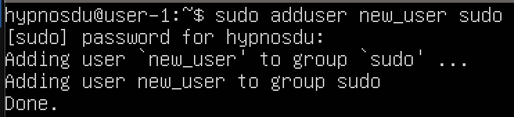

# ОТЧЕТ О ВЫПОЛНЕНИИ ПРОЕКТА D01_Linux

## Part 1. Установка ОС

##### ЗАДАЧА: установить **Ubuntu 20.04 Server LTS** без графического интерфейса. 


## Part 2. Создание пользователя

##### ЗАДАЧА: создать пользователя, отличного от пользователя, который создавался при установке. Пользователь должен быть добавлен в группу `adm`.

Создание пользователя new_user и добавление в группу adm:\


Пользователь new_user в группе adm:\


Вывод команды cat etc/passwd:\


## Part 3. Настройка сети ОС

##### ЗАДАЧА: задать название машины вида user-1  

Команда для изменения названия машины на user-1:\


##### ЗАДАЧА: установить временную зону, соответствующую вашему текущему местоположению.  

Установка временной зоны Europe/Moscow:\


##### ЗАДАЧА: вывести названия сетевых интерфейсов с помощью консольной команды.

Вывод названия сетевых интерфейсов:\


> lo - bнтерфейс lo является локальной петлёй, имеющей IP-адрес 127.0.0.1. Она предназначена для обеспечения сетевого доступа к компьютеру.

##### ЗАДАЧА: используя консольную команду получить ip адрес устройства, на котором вы работаете, от DHCP сервера. 

ip адрес устройства:\


> DHCP (Dynamic Host Configuration Protocol) — сетевой протокол, позволяющий сетевым устройствам автоматически получать IP-адрес и другие параметры, необходимые для работы в сети TCP/IP

##### ЗАДАЧА: определить и вывести на экран внешний ip-адрес шлюза (ip) и внутренний IP-адрес шлюза, он же ip-адрес по умолчанию (gw). 

Вывод внешнего ip адреса шлюза:\


Вывод внутреннего ip адреса шлюза:\


##### ЗАДАЧА: задать статичные (заданные вручную, а не полученные от DHCP сервера) настройки ip, gw, dns (использовать публичный DNS серверы, например 1.1.1.1 или 8.8.8.8).

- выполнить команду ```sudo nano ../../etc/netplan/00-installer-config.yaml```
- в строке dhcp заменить true на false
- дописать строку addresses и задать статичный ip
- дописать строку gateway4 и задать статичный gw
- дописать строку nameservers и задать статичные адреса DNS
- выполнить команду ```netplan apply```

Файл после изменения настроек:\


##### ЗАДАЧА: перезагрузить виртуальную машину. Убедиться, что статичные сетевые настройки (ip, gw, dns) соответствуют заданным в предыдущем пункте.

- выполнить команду ```reboot```

Вывод ip после изменения настроек:\


##### ЗАДАЧА: успешно пропинговать удаленные хосты 1.1.1.1 и ya.ru и вставить в отчёт скрин с выводом команды. В выводе команды должна быть фраза "0% packet loss".

Ping 1.1.1.1:\


Ping ya.ru:\


## Part 4. Обновление ОС

##### Задача: обновить системные пакеты до последней на момент выполнения задания версии.

- Выполнить команду ```apt update```
- Выполнить команду ```apt upgrade```

Системные пакеты обновлены:\


## Part 5. Использование команды **sudo**

##### ЗАДАЧА: разрешить пользователю, созданному в Part 2, выполнять команду sudo.

> Sudo означает SuperUser DO и используется для доступа к файлам и операциям с ограниченным доступом. По умолчанию Linux ограничивает доступ к определенным частям системы, предотвращая компрометацию конфиденциальных файлов. Команда sudo временно повышает привилегии, позволяя пользователям выполнять конфиденциальные задачи без входа в систему как пользователь root.

Установка нового пароля для new_user:\


Добавление new_user в группу sudo:\


Проверка наличия new_user в группе sudo:\


Изменение hostname от имени new_user:\


## Part 6. Установка и настройка службы времени

##### ЗАДАЧА: Вывести время часового пояса, в котором вы сейчас находитесь. Вывод следующей команды timedatectl show должен содержать `NTPSynchronized=yes`\

Вывод часового пояса и timedatectl show:\


## Part 7. Установка и использование текстовых редакторов 

##### ЗАДАЧА: установить текстовые редакторы **VIM** (+ любые два по желанию **NANO**, **MCEDIT**, **JOE** и т.д.)  

Выполнить команды:
- ```sudo apt install nano```
- ```sudo apt install vim```
- ```sudo apt install joe```

##### ЗАДАЧА: используя каждый из трех выбранных редакторов, создайте файл *test_X.txt*, где X -- название редактора, в котором создан файл. Напишите в нём свой никнейм, закройте файл с сохранением изменений.

NANO:\


- для выхода с сохранением изменений в NANO используются: CNTR + X, затем ENTER

VIM:\


- для выхода с сохранением изменений в VIM используются: a - для входа в режим редактирования, ESC для выхода из режима ввода текста, :wq! - для выхода с сохраненем

JOE:\


- для выхода с сохранением изменений в JOE используются: CNTR + KX 

##### ЗАДАЧА: используя каждый из трех выбранных редакторов, откройте файл на редактирование, отредактируйте файл, заменив никнейм на строку "21 School 21", закройте файл без сохранения изменений.

NANO:\


- для выхода без сохранения изменений в NANO используются: CNTR + X -> N

VIM:\


- для выхода без сохранения изменений в VIM используются: a - для входа в режим редактирования, ESC для выхода из режима ввода текста, :q! - для выхода без сохранения

JOE:\


- для выхода без сохранения изменений в JOE используются: CNTR + C -> y

##### ЗАДАЧА: используя каждый из трех выбранных редакторов, отредактируйте файл ещё раз (по аналогии с предыдущим пунктом), а затем освойте функции поиска по содержимому файла (слово) и замены слова на любое другое.

Для поиска слова в конец файлов добавлено слово search

NANO - результат поиска слова (CNTR W -> word -> ENTER):\


NANO - команды для замены слова (CNTR + R):\


VIM - результат поиска слова (:? или :/):\


VIM - команды для замены слова (:s/searchrd_word/substitute word):\


JOE - результат поиска слова:\


JOE - команды для замены слова (CNTR + KF):\


## Part 8. Установка и базовая настройка сервиса **SSHD**

##### ЗАДАЧА: установить службу SSHd. 

- Выполняем команду ```sudo apt istall openssh-server```  

##### ЗАДАЧА: добавить автостарт службы при загрузке системы.  

- Выполняем команду ```sudo systemctl enable ssh.service```  

##### ЗАДАЧА: перенастроить службу SSHd на порт 2022. 

- Открыть файл etc/ssh/sshd_config
- Изменить порт на 2022, сохоанить и выйти
- Выполнить команду ```sudo systemctl restart sshd```

##### ЗАДАЧА: используя команду ps, показать наличие процесса sshd. Для этого к команде нужно подобрать ключи.  

- Выполнить команду ```ps -F -C sshd```

Вывод команды:\


##### ЗАДАЧА: в отчёте объяснить значение команды и каждого ключа в ней.  

> Команда ps показывает активные процессы. Клюс -С (сокр. от cmdlist) выбрает процессы по названию процесса. Ключ -F делает вывод в расширенном формате - больше колонок.

##### ЗАДАЧА: перезагрузить систему.

- Выполняем команду ```reboot```

##### ЗАДАЧА: вывод команды netstat -tan должен содержать "tcp 0 0 0.0.0.0:2022 0.0.0.0:* LISTEN" \

Вывод команды netstat -tan:\


##### ЗАДАЧА: в отчёте объяснить значение ключей -tan, значение каждого столбца вывода, значение 0.0.0.0.

Флаги:
> -t - протокол передачи данных tcp\

>  -a - показывает состояние всех сокетов, включая неактивные (ip + port)\

>  -n - показывает адреса сети как числа, а не символами\

Столбцы:

> Proto - проткол передачи данных, используемый сокетом

>  Recv-Q - количетство байт, не скопированных программой пользователя, подключенной к сокету.

>  Send-Q - количетство байт, получение которых НЕ подтверждено удвленным хостом

>  Local Address -  ip адрес и номер порта на локальном хосте.

>  Foreign Address - ip адрес и порт удаленного сокета

>  State - состояние сокета (Установлено соединение, закрыто и т.п)

>  0.0.0.0 - ssh сервер доступен на всех сетевых интерфейсах, использующих порт 2022

## Part 9. Установка и использование утилит **top**, **htop**

##### ЗАДАЧА: установить и запустить утилиты top и htop.  

- Утилиты уже установлены


##### ЗАДАЧА: по выводу команды top определить и написать в отчёте:

Вывод top:\


  - uptime: 41 min
  - количество авторизованных пользователей: 1 user
  - общая загрузка системы: 0.04 (4 %)
  - общее количество процессов: 101
  - загрузка cpu: 0.0
  - загрузка памяти: 457.2
  - pid процесса занимающего больше всего памяти: 1
  - pid процесса, занимающего больше всего процессорного времени: 1217

##### ЗАДАЧА: в отчёт вставить скрин с выводом команды htop:

Запуск htop:\


- команда для сортировки F6 -> выбрать клавишами UP/DOWM вид сортировки

Вывод htop, сортировка по PID:\


Вывод htop, сортировка по PERCENT_CPU:\


Вывод htop, сортировка по PERCENT_MEM:\


Вывод htop, сортировка по TIME:\


- команда для фильтра F4 -> ввод фильтра

Вывод htop отфильтрованному для процесса sshd:\


- команда для поиска F3 -> ввод слова

Вывод htop с процессом syslog, найденным, используя поиск:\


- команда для поиска F2 -> добавить clock, hostname, uptime

Вывод htop с добавленным выводом hostname, clock и uptime:\


## Part 10. Использование утилиты **fdisk**

##### ЗАДАЧА: запустить команду fdisk -l.

Вывод команды fdisk -l:\


##### ЗАДАЧА: написать название жесткого диска, его размер и количество секторов, а также размер swap.

- название жесткого диска: no name (dev/vda)
- размер: 6 GB
- количество секторов: 12582912
- размер swap: 0 (free -h)

## Part 11. Использование утилиты **df** 

##### ЗАДАЧА: запустить команду df. 

Вывод команды df:\


##### ЗАДАЧА: в отчёте написать для корневого раздела (/):

Вывод команды df / -h:\


  - размер раздела: 5.4G
  - размер занятого пространства: 3.4G
  - размер свободного пространства: 1.7G
  - процент использования: 67%

##### ЗАДАЧА: определить и написать в отчёт единицу измерения в выводе. 

  - Единица измерения - по умолчанию Кб

##### ЗАДАЧА: запустить команду df -Th.

Вывод команды df -Th:\


##### ЗАДАЧА: в отчёте написать для корневого раздела (/):

  - размер раздела: 5.5G
  - размер занятого пространства: 3.4G
  - размер свободного пространства: 1.7G
  - процент использования: 67%

##### ЗАДАЧА: определить и написать в отчёт тип файловой системы для раздела.

  - тип файловой системы для раздела: ext4

## Part 12. Использование утилиты **du**

##### ЗАДАЧА: запустить команду du.

Вывод команды du:\


##### ЗАДАЧА: вывести размер папок /home, /var, /var/log (в байтах, в человекочитаемом виде)

Размер папок /home, /var, /var/log:\


##### ЗАДАЧА: вывести размер всего содержимого в /var/log (не общее, а каждого вложенного элемента, используя *)

Размер содержимого /var/log/*:\


## Part 13. Установка и использование утилиты **ncdu**

##### ЗАДАЧА: установить утилиту ncdu.

```sudo apt install ncdu```

##### ЗАДАЧА: вывести размер папок /home, /var, /var/log.

```ncdu [options] dir```

Размер  /var:\


Размер  /home:\


Размер  /var/log:\


## Part 14. Работа с системными журналами

##### ЗАДАЧА: открыть для просмотра /var/log/dmesg

```less var/log/dmesg```

Вывод  var/log/dmesg:\


##### ЗАДАЧА: открыть для просмотра /var/log/syslog

```less var/log/syslog```

Вывод  var/log/syslog:\


##### ЗАДАЧА: открыть для просмотра /var/log/auth.log  

```less var/log/auth.log```

Вывод  var/log/auth.log:\


##### ЗАДАЧА: написать в отчёте время последней успешной авторизации, имя пользователя и метод входа в систему

Вывод из auth.log:\


##### ЗАДАЧА: перезапустить службу SSHd

```sudo systemctl restart sshd```

##### ЗАДАЧА: вставить в отчёт скрин с сообщением о рестарте службы (искать в логах)

Вывод из auth.log:\


## Part 15. Использование планировщика заданий **CRON**

Установка cron: ```sudo apt install cron```

##### ЗАДАЧА: используя планировщик заданий, запустите команду uptime через каждые 2 минуты.

- Выполнить  ```crontab -e```, откроется файл конфига cron\

- Записать в файл нстроект */2 * * * * uptime:\


- Логи с выполнением планировщиком команды uptime:\


- Вывод команды crontab -l для проверки текущих задач\


##### ЗАДАЧА: удалите все задания из планировщика заданий.

- Выполнить команду ```crontab -r``` для удаления задач

- Вывод команды crontab -l для проверки текущих задач\

