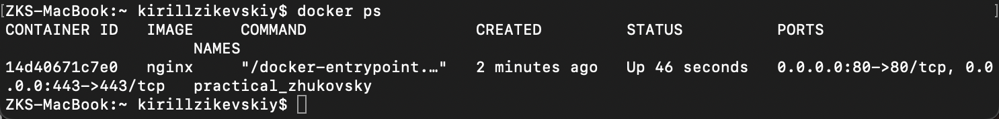

## Part 1. Готовый докер

ЗАДАЧА: Взять официальный докер-образ с nginx и выкачать его при помощи `docker pull`

- Запускаем Docker и в терминале вызываем команду `docker pull nginx`

Вывод `docker pull nginx`

- ЗАДАЧА: Проверить наличие докер-образа через `docker images`.

Вывод `docker images`

- ЗАДАЧА: Запустить докер-образ через `docker run -d [image_id|repository]`

Вывод `docker run -d nginx`

- ЗАДАЧА: Проверить, что образ запустился через `docker ps`

Вывод `docker ps`

- ЗАДАЧА: Посмотреть информацию о контейнере через `docker inspect [container_id|container_name]`

Вывод `docker inspect distracted_driscoll`

- ЗАДАЧА: По выводу команды определить и поместить в отчёт размер контейнера, список замапленных портов и ip контейнера

Размер контейнера\

Список замапленных портов\

ip контейнера\

- ЗАДАЧА: Останови докер образ через `docker stop [container_id|container_name]`

Вывод `docker stop distracted_driscoll`

- ЗАДАЧА: Проверить, что образ остановился через `docker ps`

Вывод `docker ps`

- ЗАДАЧА: Запустить докер с портами 80 и 443 в контейнере, замапленными на такие же порты на локальной машине, через команду *run*.

Вывод `docker run -d -p 80:80 -p 443:443 nginx`

- ЗАДАЧА: Проверить, что в браузере по адресу localhost:80 доступна стартовая страница nginx

Вывод localhost:80

ЗАДАЧА: Перезапустить докер контейнер через `docker restart [container_id|container_name]`

Вывод `docker restart practical_zhukovsky`

- ЗАДАЧА: Проверить любым способом, что контейнер запустился

Вывод `docker ps`

## Part 2. Операции с контейнером

- ЗАДАЧА: Прочитай конфигурационный файл nginx.conf внутри докер контейнера через команду exec

Вывод `docker exec nostalgic_hoover cat etc/nginx/nginx.conf`\

- ЗАДАЧА: Создай на локальной машине файл nginx.conf

Выполняем команду `touch nginx.conf` в папке src текущего проекта и копируем в него вывод команды `docker exec nostalgic_hoover cat etc/nginx/nginx.conf`\

- ЗАДАЧА: Настрой в нем по пути /status отдачу страницы статуса сервера nginx

- ЗАДАЧА: Скопируй созданный файл *nginx.conf* внутрь докер-образа через команду `docker cp`

- ЗАДАЧА: Перезапусти nginx внутри докер-образа через команду exec

- ЗАДАЧА: Проверь, что по адресу localhost:80/status отдается страничка со статусом сервера nginx

- ЗАДАЧА: Экспортируй контейнер в файл container.tar через команду export

- ЗАДАЧА: Останови контейнер

- ЗАДАЧА: Удали образ через `docker rmi [image_id|repository]`, не удаляя перед этим контейнеры

- ЗАДАЧА: Удали остановленный контейнер

- ЗАДАЧА: Импортируй контейнер обратно через команду import

- ЗАДАЧА: Запусти импортированный контейнер

- ЗАДАЧА: Проверь, что по адресу *localhost:80/status* отдается страничка со статусом сервера nginx

- В отчёт помести скрины:
  - вызова и вывода всех использованных в этой части задания команд;
  - содержимое созданного файла *nginx.conf*;
  - страницы со статусом сервера **nginx** по адресу *localhost:80/status*.