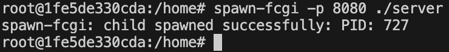
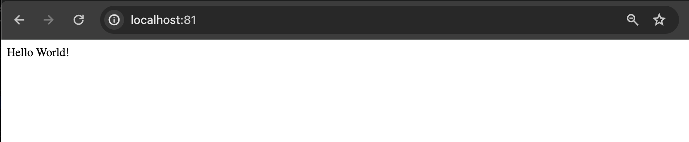
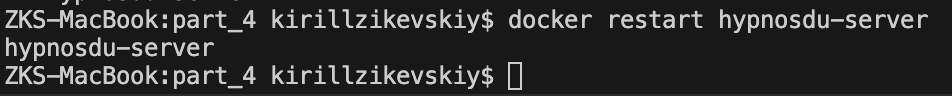
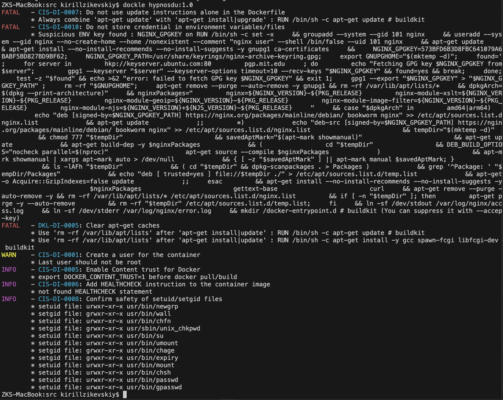
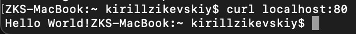

## Part 1. Готовый докер

ЗАДАЧА: Взять официальный докер-образ с nginx и выкачать его при помощи `docker pull`

- Запускаем Docker и в терминале вызываем команду `docker pull nginx`

Вывод `docker pull nginx`

- ЗАДАЧА: Проверить наличие докер-образа через `docker images`.

Вывод `docker images`

- ЗАДАЧА: Запустить докер-образ через `docker run -d [image_id|repository]`

Вывод `docker run -d nginx`

- ЗАДАЧА: Проверить, что образ запустился через `docker ps`

Вывод `docker ps`

- ЗАДАЧА: Посмотреть информацию о контейнере через `docker inspect [container_id|container_name]`

Вывод `docker inspect distracted_driscoll`

- ЗАДАЧА: По выводу команды определить и поместить в отчёт размер контейнера, список замапленных портов и ip контейнера

Размер контейнера\

Список замапленных портов\

ip контейнера\

- ЗАДАЧА: Останови докер образ через `docker stop [container_id|container_name]`

Вывод `docker stop distracted_driscoll`

- ЗАДАЧА: Проверить, что образ остановился через `docker ps`

Вывод `docker ps`

- ЗАДАЧА: Запустить докер с портами 80 и 443 в контейнере, замапленными на такие же порты на локальной машине, через команду *run*.

Вывод `docker run -d -p 80:80 -p 443:443 nginx`\

- ЗАДАЧА: Проверить, что в браузере по адресу localhost:80 доступна стартовая страница nginx

Вывод localhost:80\

ЗАДАЧА: Перезапустить докер контейнер через `docker restart [container_id|container_name]`

Вывод `docker restart practical_zhukovsky`

- ЗАДАЧА: Проверить любым способом, что контейнер запустился

Вывод `docker ps`

## Part 2. Операции с контейнером

- ЗАДАЧА: Прочитать конфигурационный файл nginx.conf внутри докер контейнера через команду exec

Вывод `docker exec nostalgic_hoover cat etc/nginx/nginx.conf`\

- ЗАДАЧА: Создать на локальной машине файл nginx.conf

Выполняем команду `touch nginx.conf` в папке src текущего проекта и копируем в него вывод команды `docker exec nostalgic_hoover cat etc/nginx/nginx.conf`\

- ЗАДАЧА: Настроить в нем по пути /status отдачу страницы статуса сервера nginx\

Вывод `docker exec crazy_tharp cat etc/nginx/nginx.conf`\

- ЗАДАЧА: Скопировать созданный файл *nginx.conf* внутрь докер-образа через команду `docker cp`

Вывод `docker cp nginx.conf crazy_tharp:/etc/nginx`\

- ЗАДАЧА: Перезапустить nginx внутри докер-образа через команду exec

Вывод `docker exec crazy_tharp nginx -s reload`\

- ЗАДАЧА: Проверить, что по адресу localhost:80/status отдается страничка со статусом сервера nginx

Вывод localhost:80/status\

- ЗАДАЧА: Экспортировать контейнер в файл container.tar через команду export

Вывод `docker export -o container.tar crazy_tharp` и `ls`\

- ЗАДАЧА: Остановить контейнер

Вывод `docker stop crazy_tharp` и `docker ps`\

- ЗАДАЧА: Удалить образ через `docker rmi [image_id|repository]`, не удаляя перед этим контейнеры

Вывод `docker rmi -f nginx`\

- ЗАДАЧА: Удалить остановленный контейнер

Вывод `docker rm crazy_tharp`\

- ЗАДАЧА: Импортировать контейнер обратно через команду import

Вывод `docker import -c 'CMD ["nginx", "-g", "daemon off;"]' container.tar imported_nginx`\

Вывод `docker images`\

- ЗАДАЧА: Запустить импортированный контейнер

Вывод `docker run -d -p 80:80 -p 443:443 imported_nginx`\

- ЗАДАЧА: Проверить, что по адресу localhost:80/status отдается страничка со статусом сервера nginx

Вывод localhost:80/status\

## Part 3. Мини веб-сервер

- ЗАДАЧА: Написать мини-сервер на C и FastCgi, который будет возвращать простейшую страничку с надписью `Hello World!`

Вывод `cat server.c`\

- ЗАДАЧА: Запустить написанный мини-сервер через spawn-fcgi на порту 8080

Вывод `docker run -d -p 81:81 nginx`\

Вывод `docker cp nginx.conf sharp_yalow:/etc/nginx`\

Вывод `docker cp server.c sharp_yalow:/home`\

Вывод `docker exec -it sharp_yalow bash`\

Вывод `apt-get update`\

Вывод `apt-get install gcc spawn-fcgi libfcgi-dev`\

Компилируем server.c командой: gcc server.c -lfcgi -o server

Вывод `spawn-fcgi -p 8080 ./server`\

Вывод `nginx -s reload`\

- ЗАДАЧА: Написать свой nginx.conf, который будет проксировать все запросы с 81 порта на 127.0.0.1:8080

Вывод `cat nginx.conf`\

- ЗАДАЧА: Проверить, что в браузере по localhost:81 отдается написанная тобой страничка

Вывод localhost:81\

## Part 4. Свой докер

При написании докер-образа избегай множественных вызовов команд RUN

- ЗАДАЧА: Написать свой докер-образ, который:
1) собирает исходники мини сервера на FastCgi из части 3;
2) запускает его на 8080 порту;
3) копирует внутрь образа написанный ./nginx/nginx.conf;
4) запускает nginx;

nginx можно установить внутрь докера самостоятельно, а можно воспользоваться готовым образом с nginx'ом, как базовым.

Вывод `cat Dockerfile`\

Вывод `cat run.sh`\

- ЗАДАЧА: Собрать написанный докер-образ через `docker build` при этом указав имя и тег

Вывод `docker build -t hypnosdu:1.0 .`\

- ЗАДАЧА: Проверить через `docker images`, что все собралось корректно

Вывод `docker images`\

- ЗАДАЧА: Запустить собранный докер-образ с маппингом 81 порта на 80 на локальной машине и маппингом папки ./nginx внутрь контейнера по адресу, где лежат конфигурационные файлы nginx'а (см. Часть 2)

Вывод `docker run -it --name hypnosdu-server -d -p 80:81 -v /Users/kirillzikevskiy/Desktop/S21/DO5_SimpleDocker-1/src/part_4/nginx.conf:/etc/nginx/nginx.conf hypnosdu:1.0`\

- ЗАДАЧА: Проверить, что по localhost:80 доступна страничка написанного мини сервера

Вывод `curl localhost:80`\

Вывод localhost:80\

- ЗАДАЧА: Дописать в ./nginx/nginx.conf проксирование странички /status, по которой надо отдавать статус сервера nginx

Вывод `cat nginx.conf`\

- ЗАДАЧА: Перезапустить докер-образ
*Если всё сделано верно, то, после сохранения файла и перезапуска контейнера, конфигурационный файл внутри докер-образа должен обновиться самостоятельно без лишних действий*

Вывод `docker restart hypnosdu-server`\

- ЗАДАЧА: Проверить, что теперь по localhost:80/status отдается страничка со статусом nginx

Вывод localhost:80/status\

Вывод `curl localhost:80/status`\

## Part 5. Dockle

- Устанавливаем dockle. Для MacOS команда `brew install goodwithtech/r/dockle`

- ЗАДАЧА: Просканировать образ из предыдущего задания через `dockle [image_id|repository]`

Вывод `dockle hypnosdu:1.0`\

- ЗАДАЧА: Исправить образ так, чтобы при проверке через dockle не было ошибок и предупреждений

Вывод `cat Dockerfile`\

Вывод `dockle -ak NGINX_GPGKEY -ak NGINX_GPGKEY_PATH hypnosdu:1.0`\

## Part 6. Базовый **Docker Compose**

- ЗАДАЧА: Написать файл docker-compose.yml, с помощью которого:
1) Поднять докер-контейнер из Части 5 (он должен работать в локальной сети, т.е. не нужно использовать инструкцию EXPOSE и мапить порты на локальную машину)
2) Поднять докер-контейнер с nginx, который будет проксировать все запросы с 8080 порта на 81 порт первого контейнера

Вывод `cat docker-compose.yml`\

- ЗАДАЧА: Замапить 8080 порт второго контейнера на 80 порт локальной машины

Вывод `cat docker-compose.yml`\

- ЗАДАЧА: Остановить все запущенные контейнеры

Выполняем `docker stop [CONTAINER]`

- ЗАДАЧА: Соберать и запустить проект с помощью команд `docker-compose build` и `docker-compose up`

Для того, чтобы контейнер с сервером из части 5 не останавливался после выполнения скрипта и продолжал работать, дописываем в скрипт run.sh из части 5 команду `while true; do sleep 1 done`

Вывод run.sh  из части 5\

Вывод `docker-compose build`\

Вывод `docker-compose up`\

- ЗАДАЧА: Проверить, что в браузере по localhost:80 отдается написанная тобой страничка, как и ранее

Вывод localhost:80\

Вывод `curl localhost:80`\
