#  ОТЧЕТ ПО ВЫПОЛНЕНИЮ ЗАДАНИЙ ПРОЕКТА LINUX NETWORK

## Part 1. Инструмент ipcalc

ЗАДАЧА: поднять виртуальную машину (далее -- ws1)

Вывод версии ubuntu server после установки на виртуальную машину:

#### 1.1. Сети и маски

ЗАДАЧА: определить и записать в отчет адрес сети 192.167.38.54/13

Ответ: адрес сети 192.160.0.0

Вывод команды ipcalc 192.167.38.54/13. Адрес сети 192.160.0.0
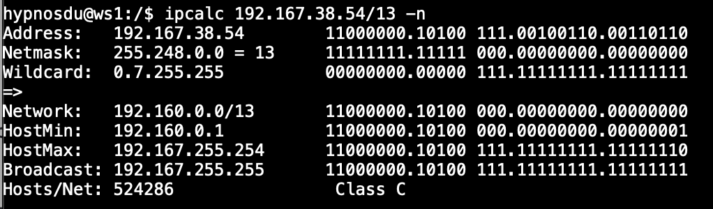

ЗАДАЧА: определить и записать в отчет перевод маски 255.255.255.0 в префиксную и двоичную запись, /15 в обычную и двоичную, 11111111.11111111.11111111.11110000 в обычную и префиксную

Вывод маски 255.255.255.0 в префиксном (24) и двоичном виде (11111111.11111111.11111111. 00000000):
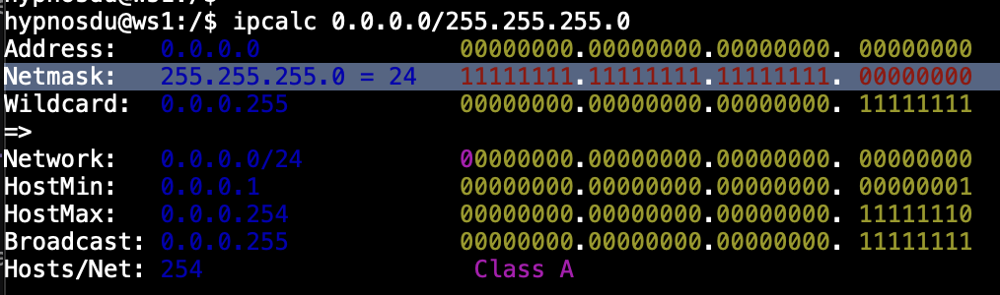

Вывод маски /15 в обычную запись и двоичную
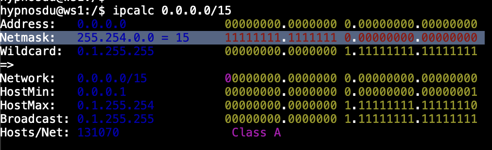

Вывод маски 11111111.11111111.11111111.11110000 в обычную и префиксную запись:

ЗАДАЧА: определить и записать в отчет минимальный и максимальный хост в сети 12.167.38.4 при масках: /8, 11111111.11111111.00000000.00000000, 255.255.254.0 и /4

Минимальный и максимальный хост в сети 12.167.38.4 при маске /8:
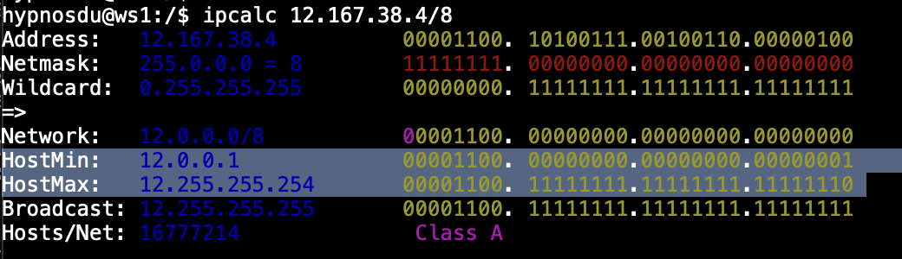

Минимальный и максимальный хост в сети 12.167.38.4 при маске 11111111.11111111.00000000.00000000:
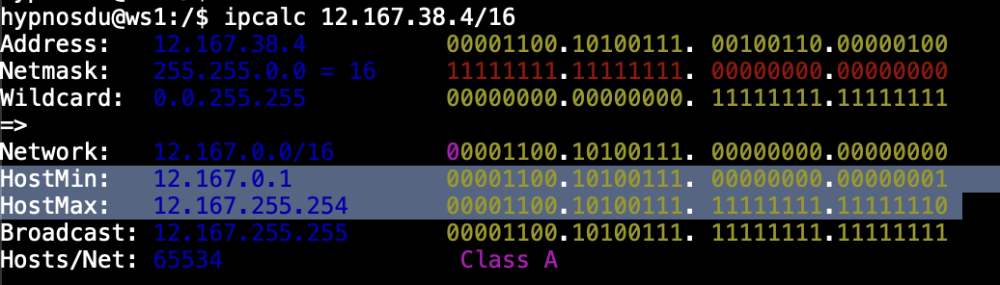

Минимальный и максимальный хост в сети 12.167.38.4 при маске 255.255.254.0:
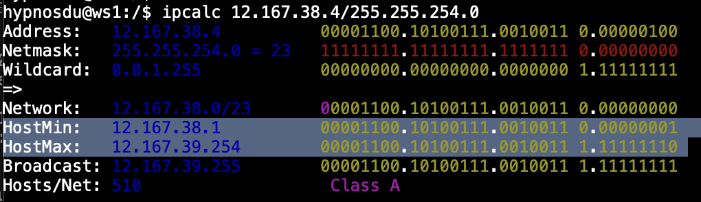

Минимальный и максимальный хост в сети 12.167.38.4 при маске /4:
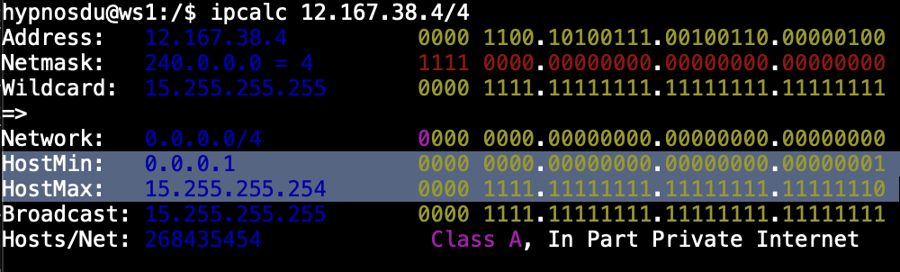

#### 1.2. localhost

ЗАДАЧА: определить и записать в отчет, можно ли обратиться к приложению, работающему на localhost, со следующими IP: 194.34.23.100, 127.0.0.2, 127.1.0.1, 128.0.0.1

Проверка ip 194.34.23.100. Вывод: нельзя (разные сети)

Проверка ip 127.0.0.2. Вывод: можно
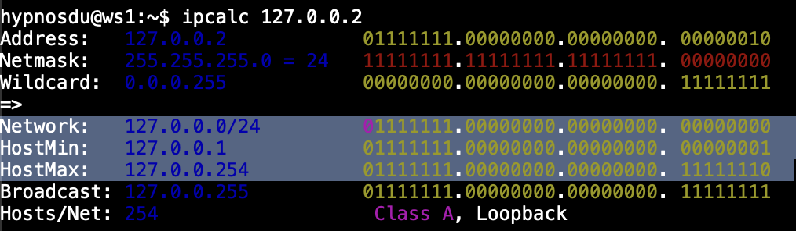

Проверка ip 127.1.0.1. Вывод: можно
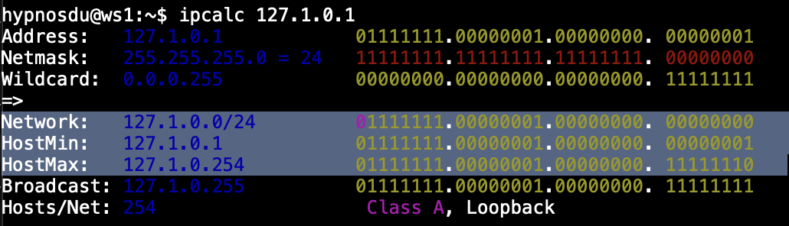

Проверка ip 128.0.0.1. Вывод: нельзя (разные сети)
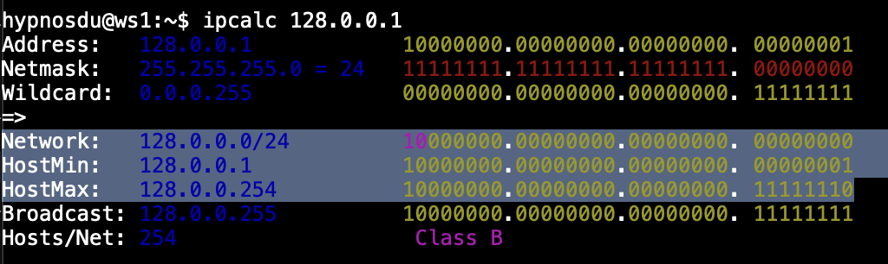

#### 1.3. Диапазоны и сегменты сетей

ЗАДАЧА: определить и записать в отчет какие из перечисленных IP можно использовать в качестве публичного, а какие только в качестве частных: 10.0.0.45, 134.43.0.2, 192.168.4.2, 172.20.250.4, 172.0.2.1, 192.172.0.1, 172.68.0.2, 172.16.255.255, 10.10.10.10, 192.169.168.1

Проверка ip 10.0.0.45. Вывод: частный
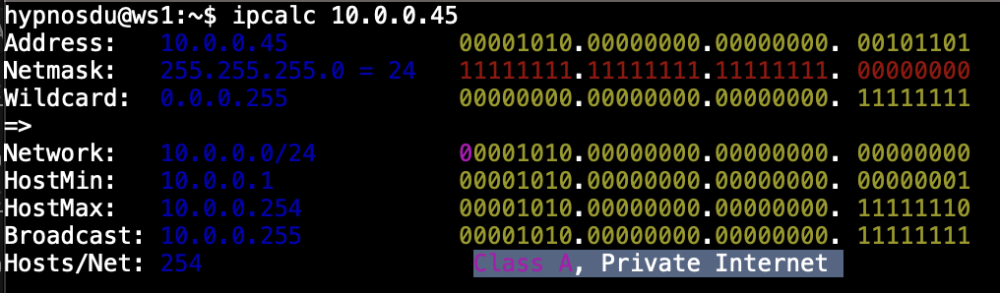

Проверка ip 134.43.0.2. Вывод: публичный
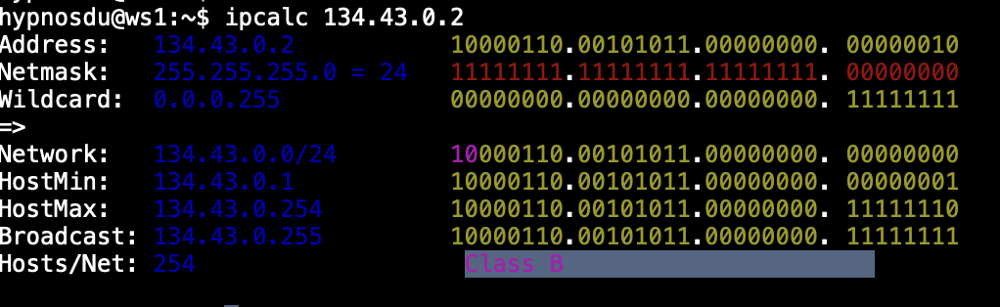

Проверка ip 192.168.4.2. Вывод: частный
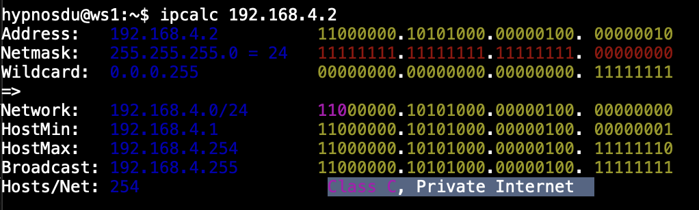

Проверка ip 172.20.250.4. Вывод: частный
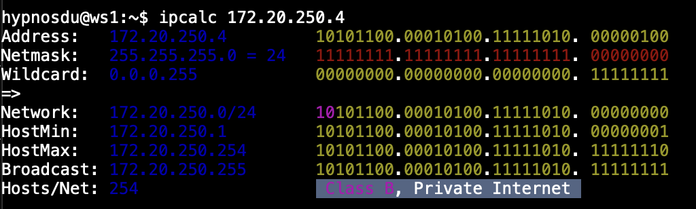

Проверка ip 172.0.2.1. Вывод: публичный
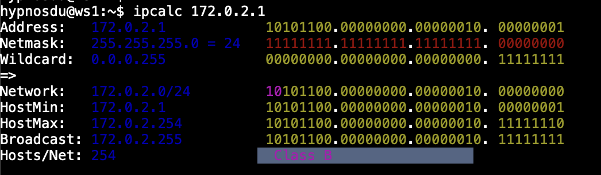

Проверка ip 192.172.0.1. Вывод: публичный
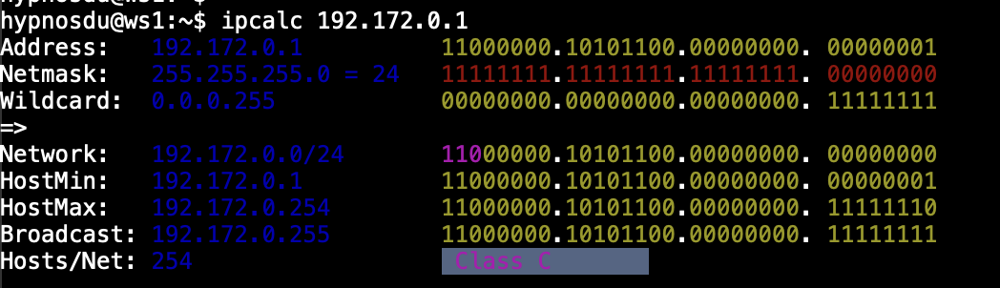

Проверка ip 172.68.0.2. Вывод: публичный
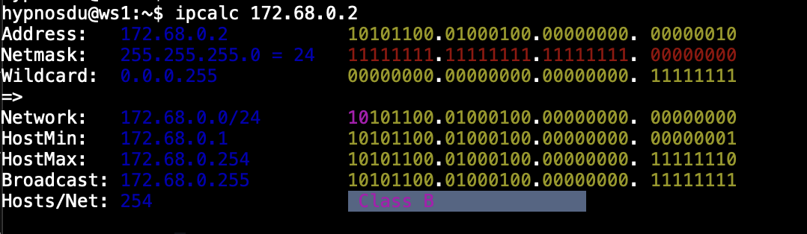

Проверка ip 172.16.255.255. Вывод: частный
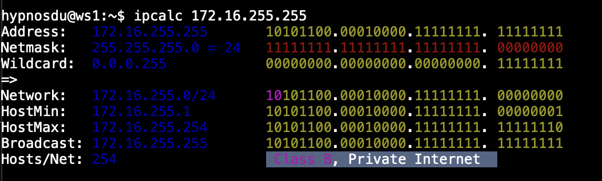

Проверка ip 10.10.10.10. Вывод: частный
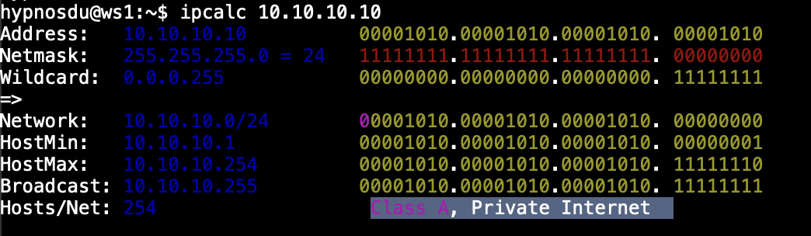

Проверка ip 192.169.168.1. Вывод: публичный
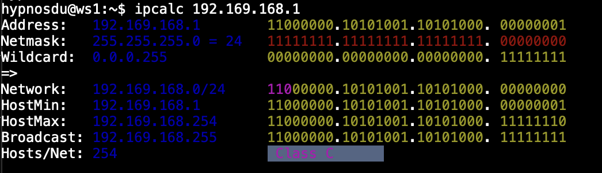

ЗАДАЧА: определить и записать в отчет какие из перечисленных IP адресов шлюза возможны у сети 10.10.0.0/18: 10.0.0.1, 10.10.0.2, 10.10.10.10, 10.10.100.1, 10.10.1.255

Проверка ip 10.10.0.0/18.
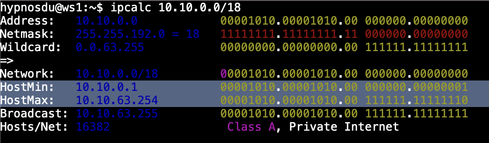

Вывод: у сети 10.10.0.0/18 возможны следующие адресы шлюза 10.10.0.2, 10.10.10.10, 10.10.1.255

## Part 2. Статическая маршрутизация между двумя машинами

ЗАДАЧА: поднять две виртуальные машины (далее -- ws1 и ws2).

Две виртуальные машины:
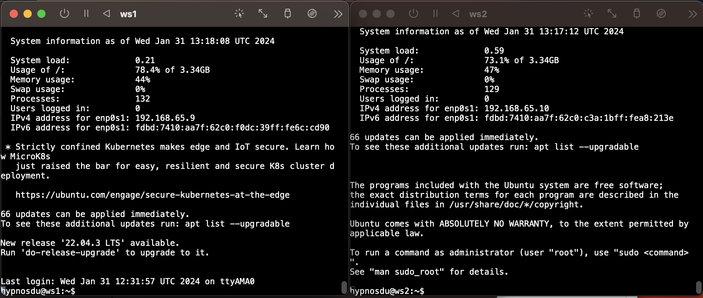

ЗАДАЧА: с помощью команды ip a посмотри существующие сетевые интерфейсы. В отчёт поместить скрин с вызовом и выводом использованной команды.

Сетевые интерфейсы ws1:
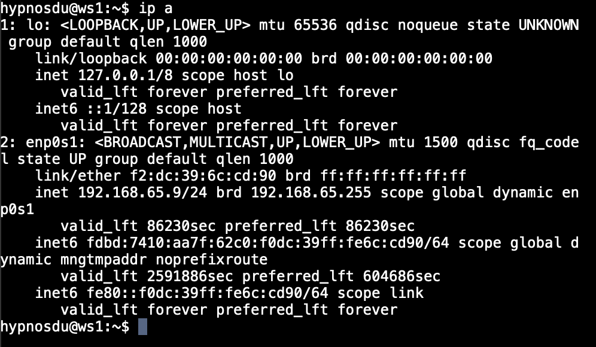

Сетевые интерфейсы ws2:
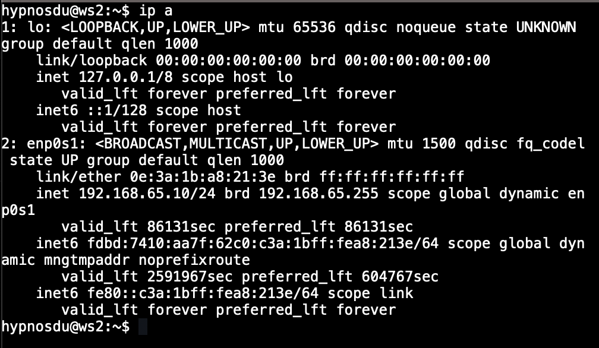

ЗАДАЧА: описать сетевой интерфейс, соответствующий внутренней сети, на обеих машинах и задать следующие адреса и маски: ws1 - 192.168.100.10, маска /16, ws2 - 172.24.116.8, маска /12. В отчёт поместить скрины с содержанием изменённого файла etc/netplan/00-installer-config.yaml для каждой машины.

Вывод sudo nano etc/netplan/00-installer-config.yaml ws1:
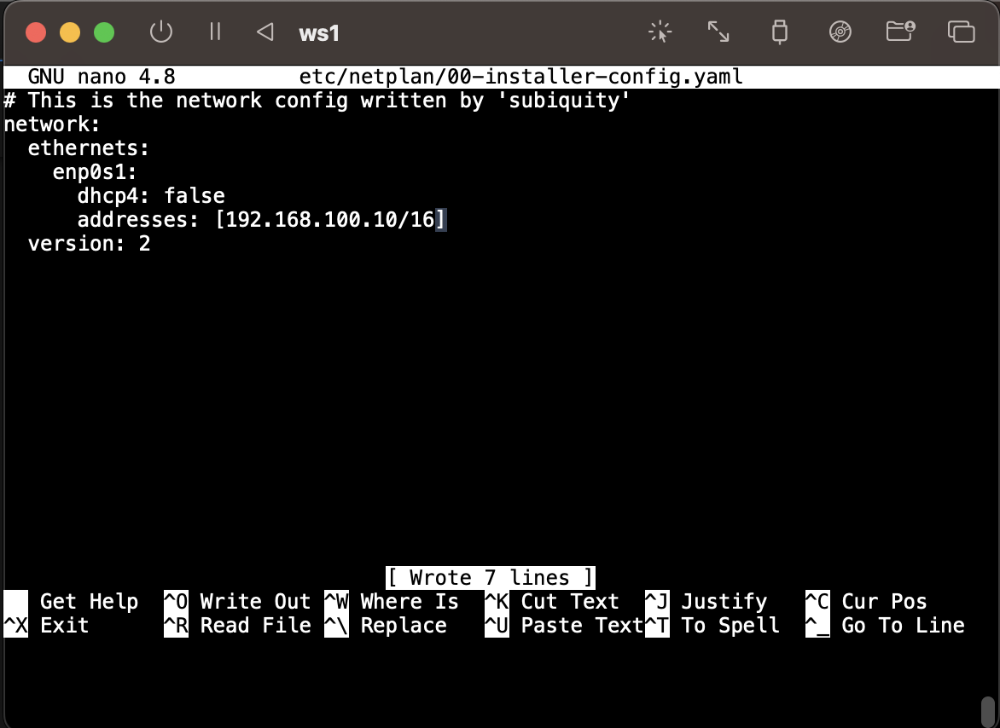

Вывод sudo nano etc/netplan/00-installer-config.yaml ws2:
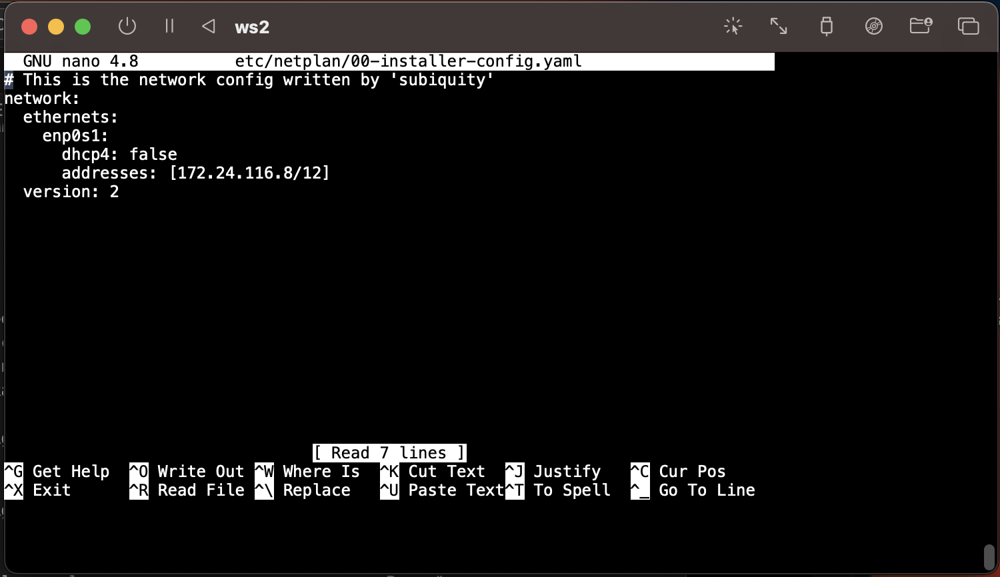

ЗАДАЧА: выполнить команду netplan apply для перезапуска сервиса сети. В отчёт поместить скрин с вызовом и выводом использованной команды.

Вывод netplan apply для ws1:
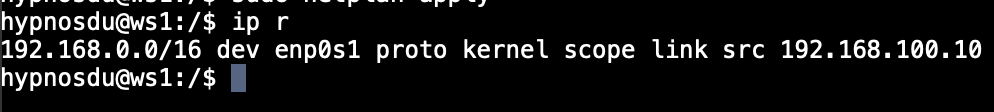

Вывод netplan apply для ws2:
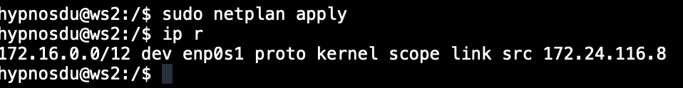

#### 2.1. Добавление статического маршрута вручную

ЗАДАЧА: добавить статический маршрут от одной машины до другой и обратно при помощи команды вида ip r add.

Вывод sudo ip r add для ws1:
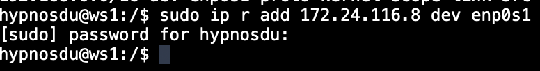

Вывод sudo ip r add для ws2:
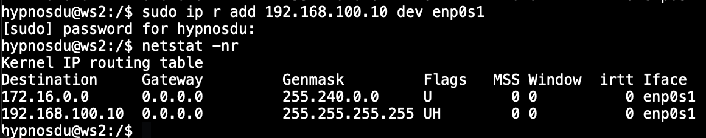

ЗАДАЧА: пропинговать соединение между машинами. В отчёт поместить скрин с вызовом и выводом использованных команд.

Вывод ping 172.24.116.8 для ws1:
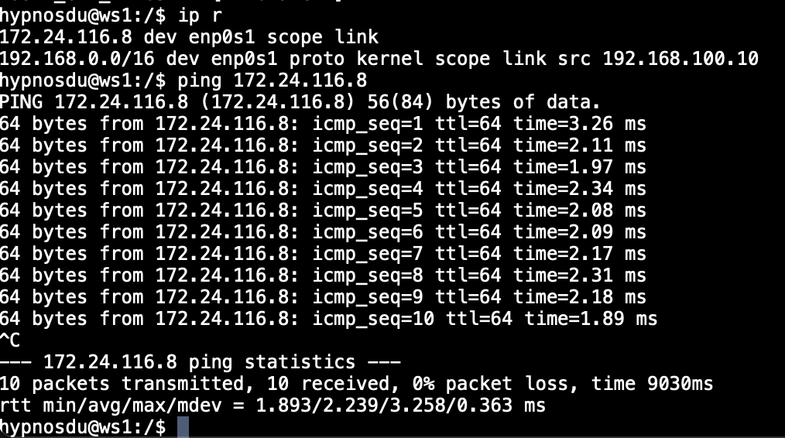

Вывод ping 192.168.100.10 для ws2:
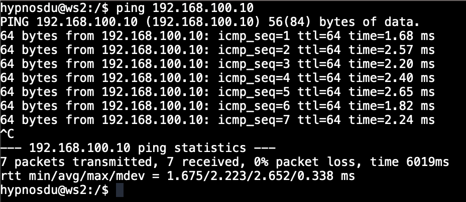

#### 2.2. Добавление статического маршрута с сохранением

ЗАДАЧА: перезапустить машины.

Используем команду sudo reboot.

ЗАДАЧА: добавить статический маршрут от одной машины до другой с помощью файла etc/netplan/00-installer-config.yaml. В отчёт поместить скрин с содержанием изменённого файла etc/netplan/00-installer-config.yaml.

Вывод sudo nano etc/netplan/00-installer-config.yaml ws1:
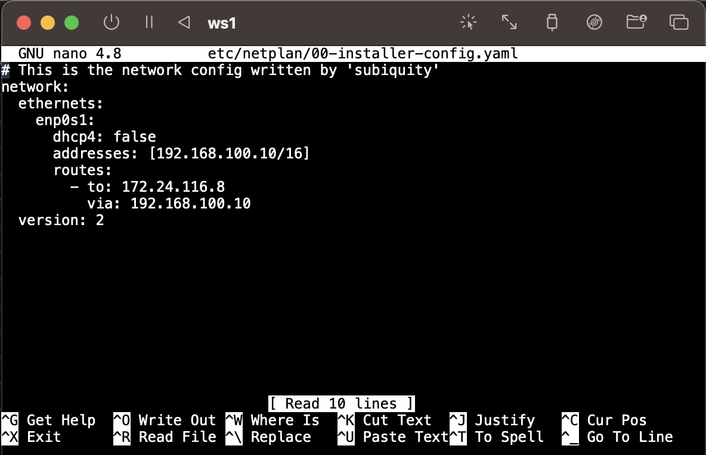

Вывод sudo nano etc/netplan/00-installer-config.yaml ws2:
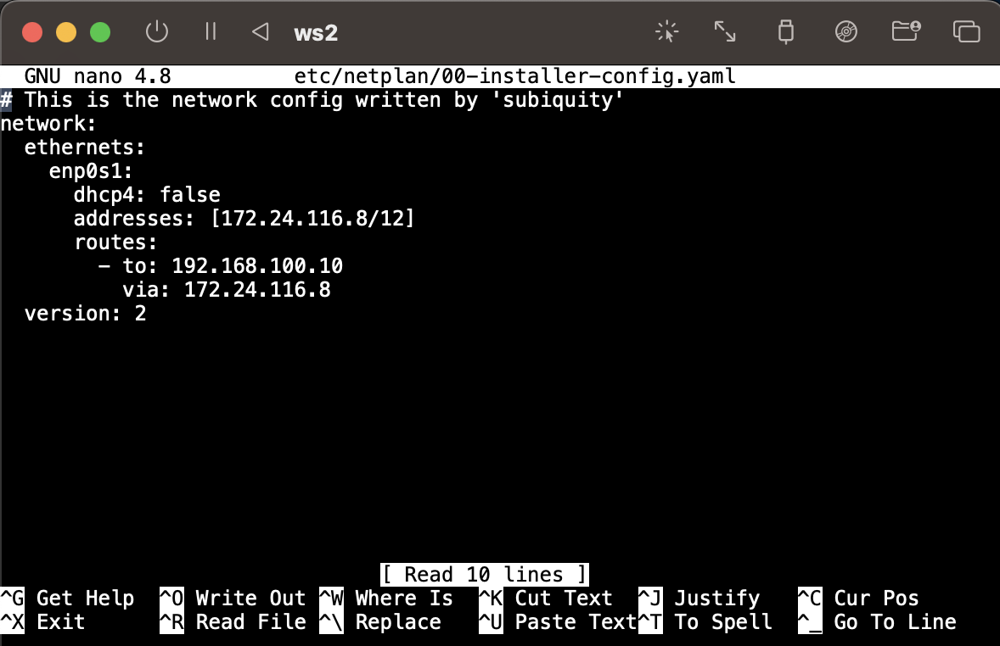

ЗАДАЧА: пропинговать соединение между машинами. В отчёт поместить скрин с вызовом и выводом использованной команды.

Применяем изменения на обоих машинах командой '''sudo netplan apply'''

Вывод ping 172.24.116.8 для ws1:
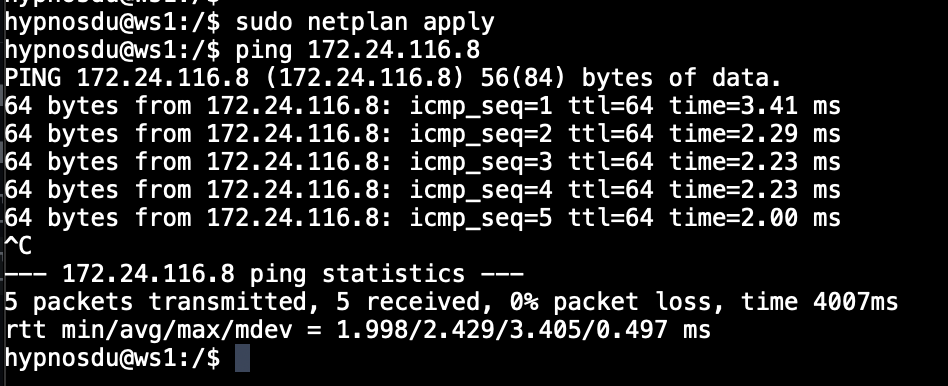

Вывод ping 192.168.100.10 для ws2:
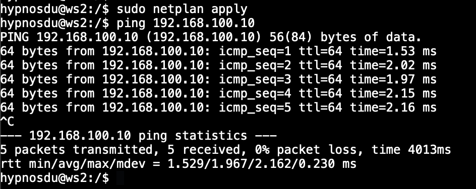

## Part 3. Утилита iperf3

## Part 4. Сетевой экран

## Part 5. Статическая маршрутизация сети

## Part 6. Динамическая настройка IP с помощью DHCP

## Part 7. NAT

## Part 8. Дополнительно. Знакомство с SSH Tunnels

