#  ОТЧЕТ ПО ВЫПОЛНЕНИЮ ЗАДАНИЙ ПРОЕКТА LINUX NETWORK

## Part 1. Инструмент ipcalc

ЗАДАЧА: поднять виртуальную машину (далее -- ws1)

Вывод версии ubuntu server после установки на виртуальную машину:


#### 1.1. Сети и маски

ЗАДАЧА: определить и записать в отчет адрес сети 192.167.38.54/13

Ответ: адрес сети 192.160.0.0

Вывод команды ipcalc 192.167.38.54/13. Адрес сети 192.160.0.0
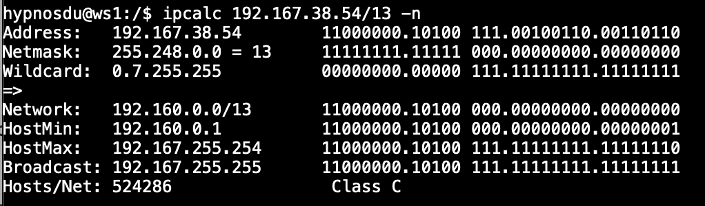

ЗАДАЧА: определить и записать в отчет перевод маски 255.255.255.0 в префиксную и двоичную запись, /15 в обычную и двоичную, 11111111.11111111.11111111.11110000 в обычную и префиксную

Вывод маски 255.255.255.0 в префиксном (24) и двоичном виде (11111111.11111111.11111111. 00000000):
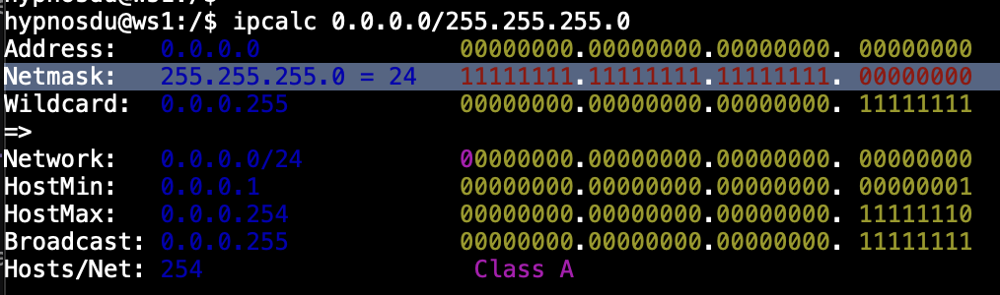

Вывод маски /15 в обычную запись и двоичную
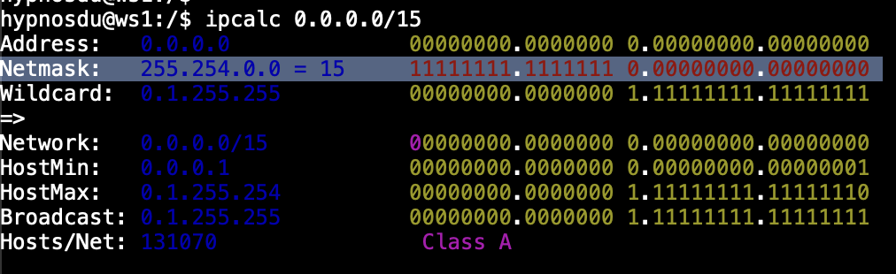

Вывод маски 11111111.11111111.11111111.11110000 в обычную и префиксную запись:


ЗАДАЧА: определить и записать в отчет минимальный и максимальный хост в сети 12.167.38.4 при масках: /8, 11111111.11111111.00000000.00000000, 255.255.254.0 и /4

Минимальный и максимальный хост в сети 12.167.38.4 при маске /8:
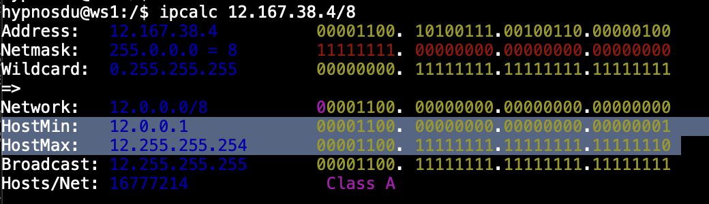

Минимальный и максимальный хост в сети 12.167.38.4 при маске 11111111.11111111.00000000.00000000:
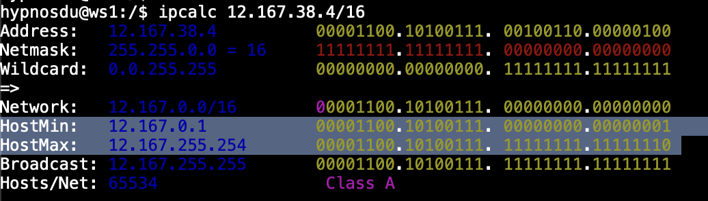

Минимальный и максимальный хост в сети 12.167.38.4 при маске 255.255.254.0:
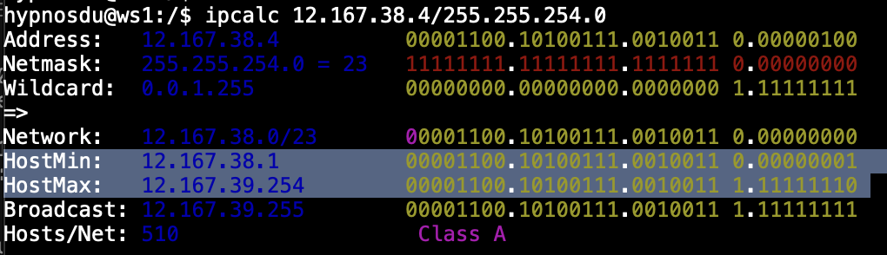

Минимальный и максимальный хост в сети 12.167.38.4 при маске /4:
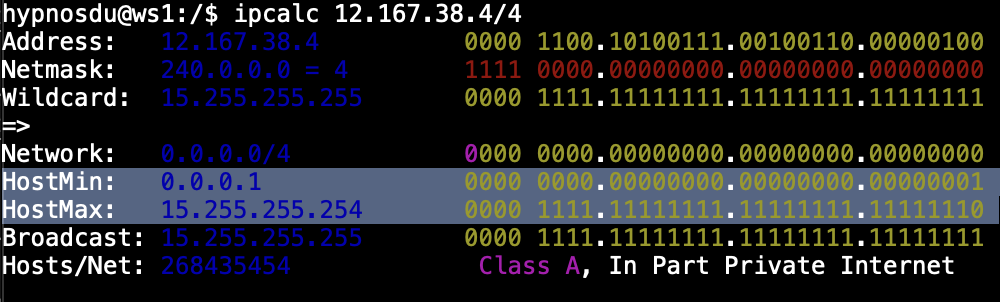

#### 1.2. localhost

ЗАДАЧА: определить и записать в отчет, можно ли обратиться к приложению, работающему на localhost, со следующими IP: 194.34.23.100, 127.0.0.2, 127.1.0.1, 128.0.0.1

Проверка ip 194.34.23.100. Вывод: нельзя (разные сети)
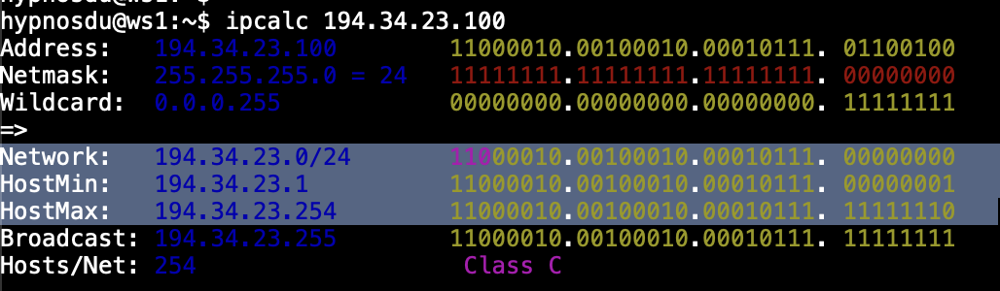

Проверка ip 127.0.0.2. Вывод: можно
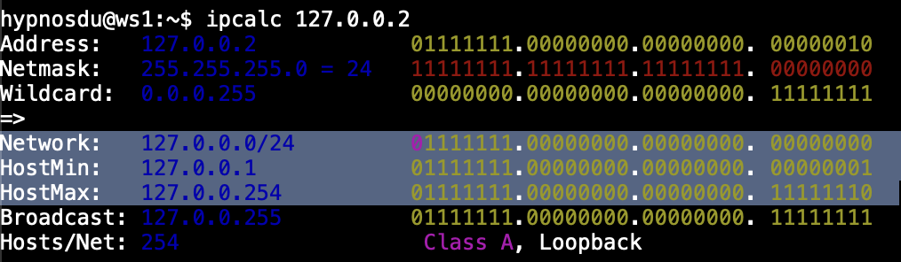

Проверка ip 127.1.0.1. Вывод: можно
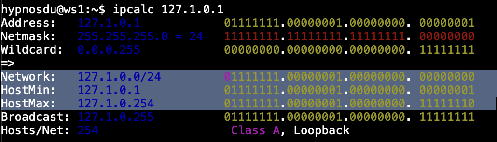

Проверка ip 128.0.0.1. Вывод: нельзя (разные сети)
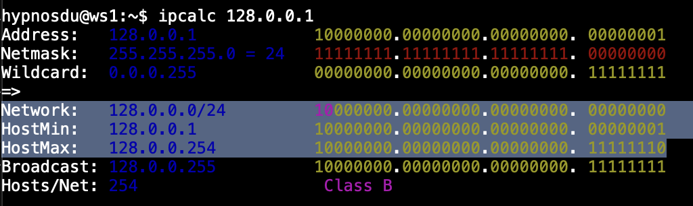

#### 1.3. Диапазоны и сегменты сетей

ЗАДАЧА: определить и записать в отчет какие из перечисленных IP можно использовать в качестве публичного, а какие только в качестве частных: 10.0.0.45, 134.43.0.2, 192.168.4.2, 172.20.250.4, 172.0.2.1, 192.172.0.1, 172.68.0.2, 172.16.255.255, 10.10.10.10, 192.169.168.1

Проверка ip 10.0.0.45. Вывод: частный
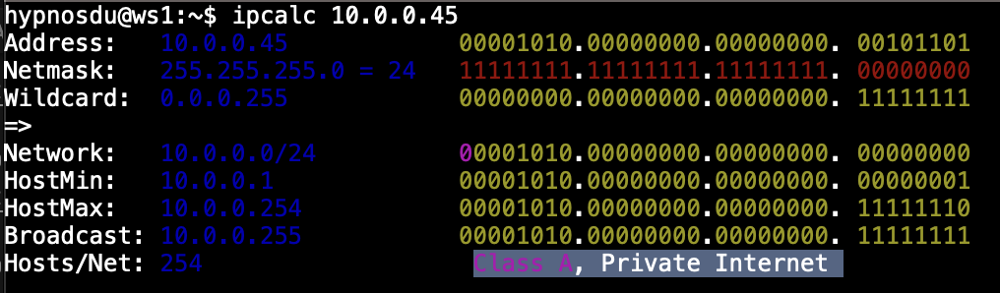

Проверка ip 134.43.0.2. Вывод: публичный
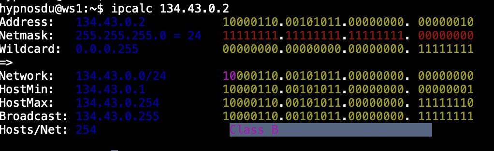

Проверка ip 192.168.4.2. Вывод: частный
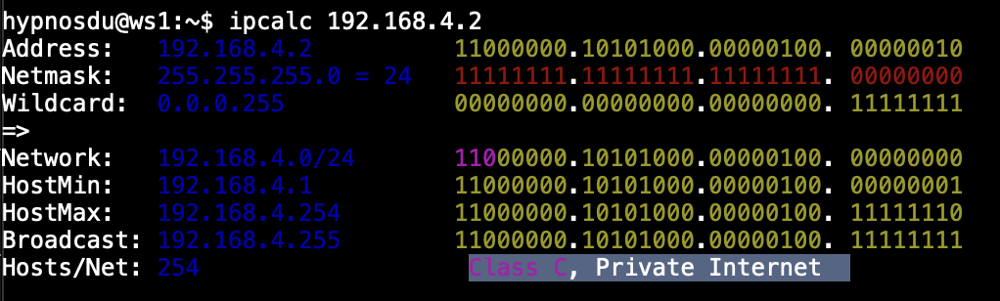

Проверка ip 172.20.250.4. Вывод: частный
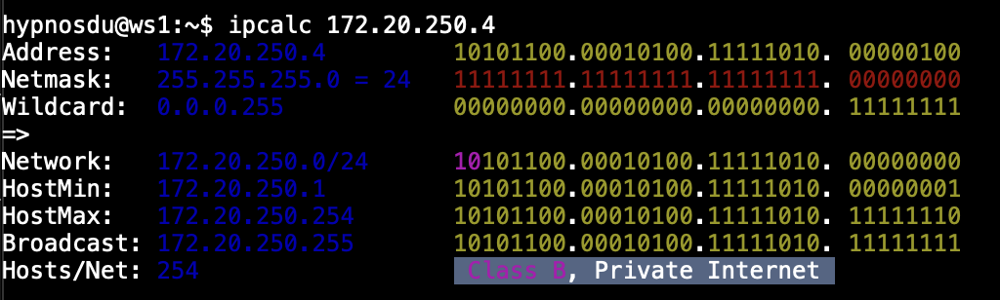

Проверка ip 172.0.2.1. Вывод: публичный
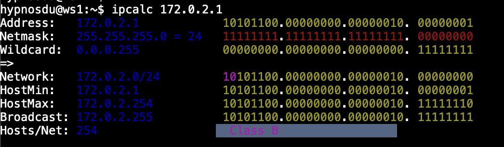

Проверка ip 192.172.0.1. Вывод: публичный
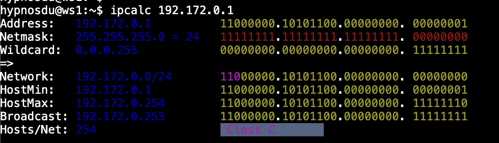

Проверка ip 172.68.0.2. Вывод: публичный


Проверка ip 172.16.255.255. Вывод: частный
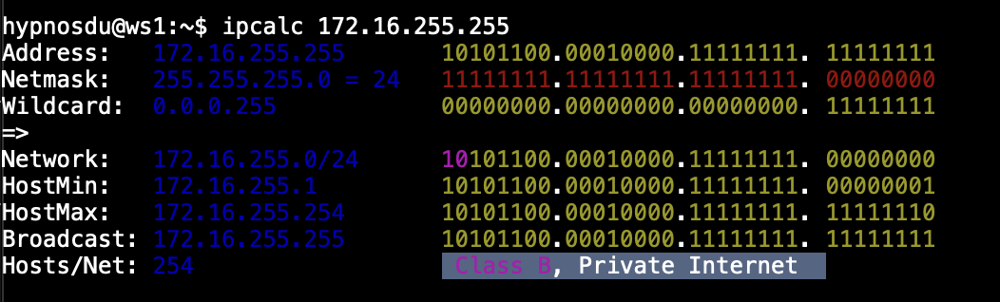

Проверка ip 10.10.10.10. Вывод: частный
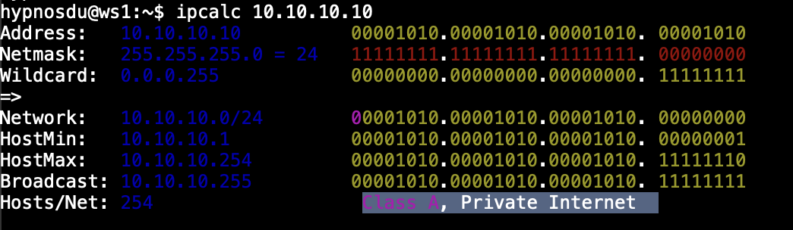

Проверка ip 192.169.168.1. Вывод: публичный
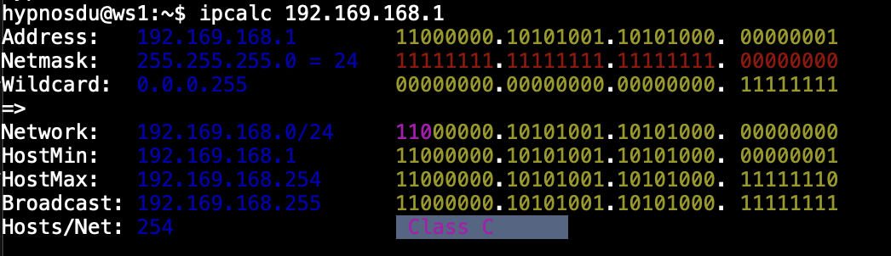

ЗАДАЧА: определить и записать в отчет какие из перечисленных IP адресов шлюза возможны у сети 10.10.0.0/18: 10.0.0.1, 10.10.0.2, 10.10.10.10, 10.10.100.1, 10.10.1.255

Проверка ip 10.10.0.0/18.
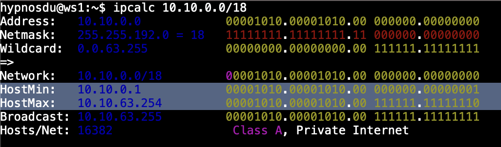

Вывод: у сети 10.10.0.0/18 возможны следующие адресы шлюза 10.10.0.2, 10.10.10.10, 10.10.1.255

## Part 2. Статическая маршрутизация между двумя машинами

ЗАДАЧА: поднять две виртуальные машины (далее -- ws1 и ws2).

Две виртуальные машины:
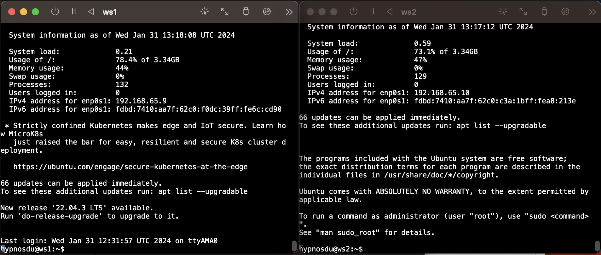

ЗАДАЧА: с помощью команды ip a посмотри существующие сетевые интерфейсы. В отчёт поместить скрин с вызовом и выводом использованной команды.

Сетевые интерфейсы ws1:
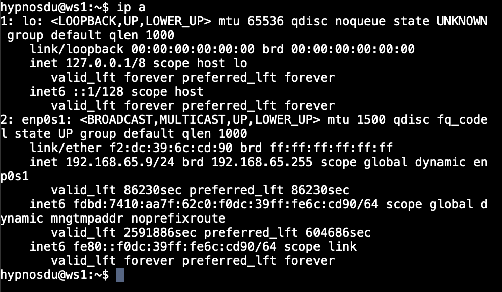

Сетевые интерфейсы ws2:


ЗАДАЧА: описать сетевой интерфейс, соответствующий внутренней сети, на обеих машинах и задать следующие адреса и маски: ws1 - 192.168.100.10, маска /16, ws2 - 172.24.116.8, маска /12. В отчёт поместить скрины с содержанием изменённого файла etc/netplan/00-installer-config.yaml для каждой машины.

Вывод sudo nano etc/netplan/00-installer-config.yaml ws1:
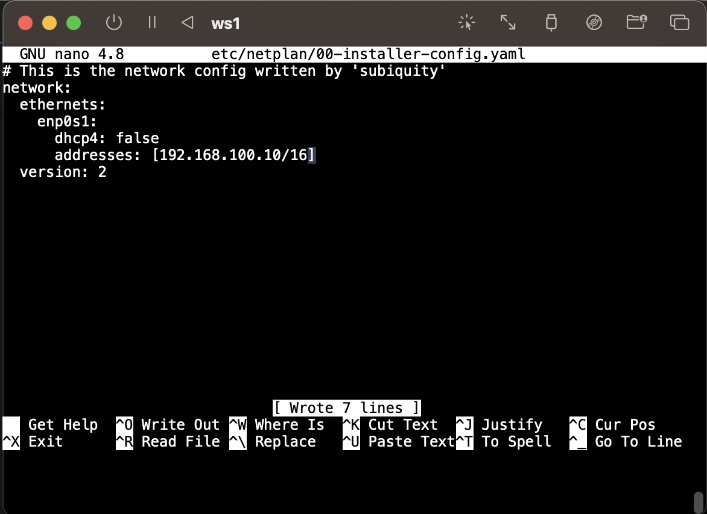

Вывод sudo nano etc/netplan/00-installer-config.yaml ws2:
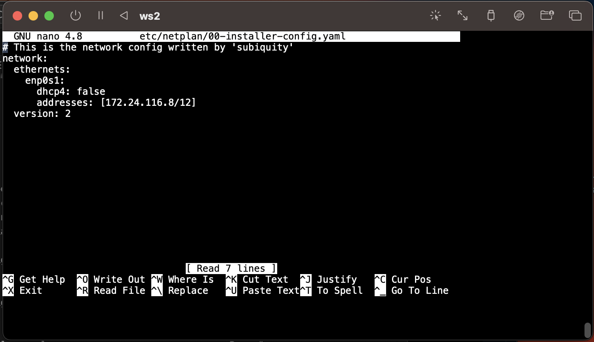

ЗАДАЧА: выполнить команду netplan apply для перезапуска сервиса сети. В отчёт поместить скрин с вызовом и выводом использованной команды.

Вывод netplan apply для ws1:
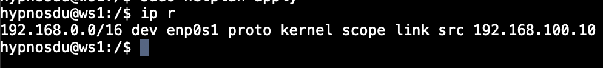

Вывод netplan apply для ws2:


#### 2.1. Добавление статического маршрута вручную

ЗАДАЧА: добавить статический маршрут от одной машины до другой и обратно при помощи команды вида ip r add.

Вывод sudo ip r add для ws1:
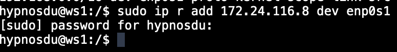

Вывод sudo ip r add для ws2:
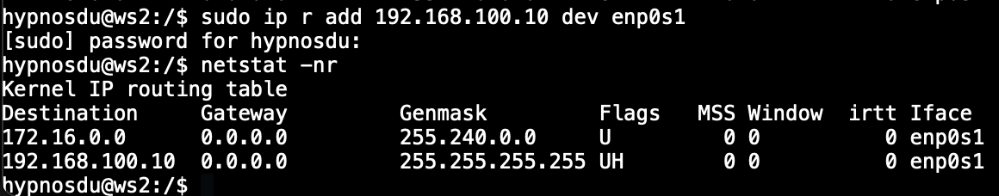

ЗАДАЧА: пропинговать соединение между машинами. В отчёт поместить скрин с вызовом и выводом использованных команд.

Вывод ping 172.24.116.8 для ws1:
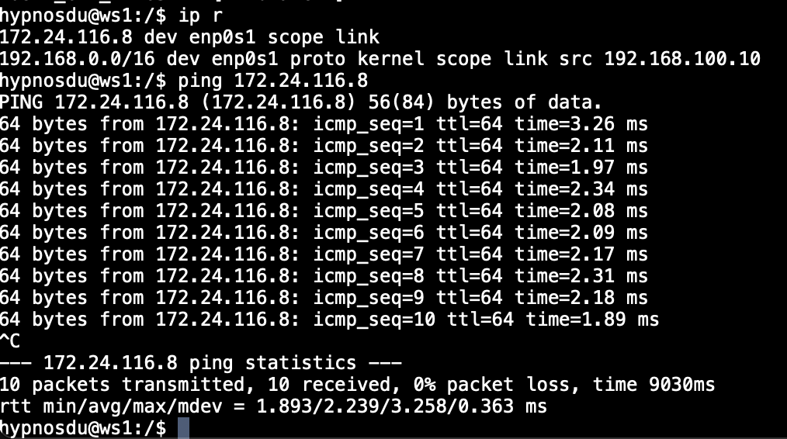

Вывод ping 192.168.100.10 для ws2:
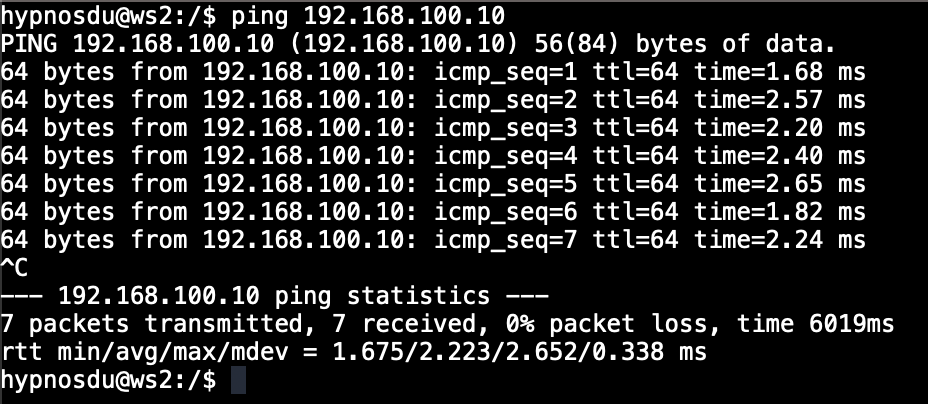

#### 2.2. Добавление статического маршрута с сохранением

ЗАДАЧА: перезапустить машины.

Используем команду sudo reboot.

ЗАДАЧА: добавить статический маршрут от одной машины до другой с помощью файла etc/netplan/00-installer-config.yaml. В отчёт поместить скрин с содержанием изменённого файла etc/netplan/00-installer-config.yaml.

Вывод sudo nano etc/netplan/00-installer-config.yaml ws1:
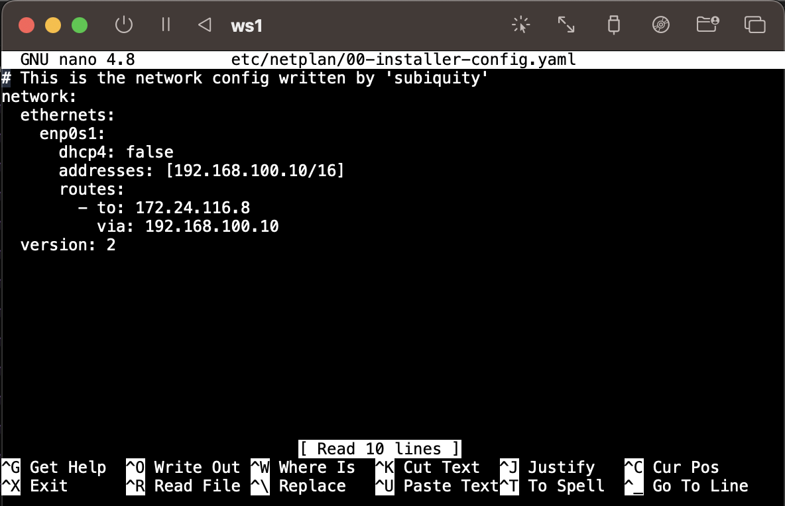

Вывод sudo nano etc/netplan/00-installer-config.yaml ws2:
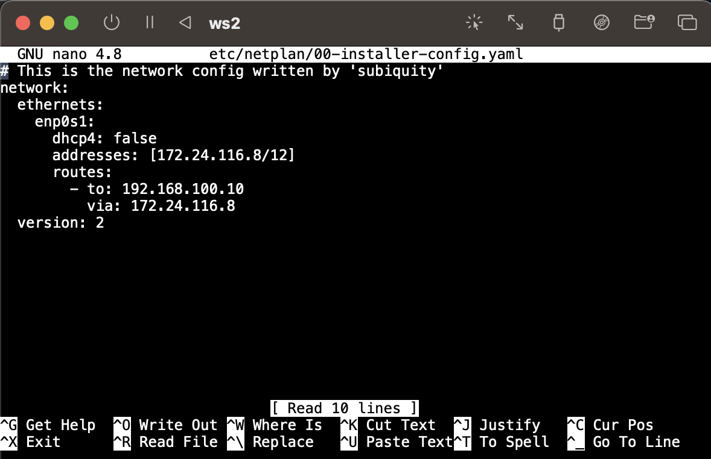

ЗАДАЧА: пропинговать соединение между машинами. В отчёт поместить скрин с вызовом и выводом использованной команды.

Применяем изменения на обоих машинах командой '''sudo netplan apply'''

Вывод ping 172.24.116.8 для ws1:
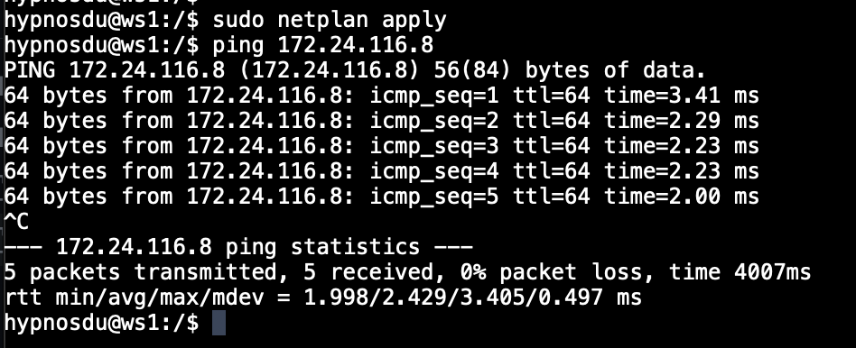

Вывод ping 192.168.100.10 для ws2:
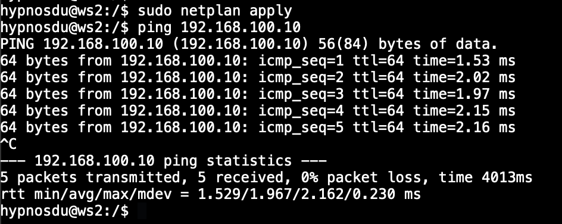

## Part 3. Утилита iperf3

#### 3.1. Скорость соединения

ЗАДАЧА: перевести и записать в отчёт: 8 Mbps в MB/s, 100 MB/s в Kbps, 1 Gbps в Mbps.

РЕШЕНИЕ:

1 Килобит (Kbps) = 1 024 бит
1 Мегабит (Mbps) = 1 024 Килобит
1 Гигабит (Gbps) = 1 024 Мегабит

1 Байт = 8 бит
1 Килобайт (KB) = 1 024 байт
1 Мегабайт (MB) = 1 024 Килобайт
1 Гигабайт (GB) = 1 024 Мегабайт

- 8 Mbps в MB/s = 8 * 1024 * 1024 / 8 / 1024 / 1024 = 1 МB/s

- 100 MB/s в Kbps = 100 * 1024 * 1024 * 8 / 1024 = 819 200 Kbps

- 1 Gbps в Mbps = 1 * 1024 * 1024 * 1024 / 1024 / 1024 = 1024 Mbps

#### 3.2. Утилита **iperf3**

ЗАДАЧА: измерить скорость соединения между ws1 и ws2. В отчёт поместить скрины с вызовом и выводом использованных команд.

Вывод iperf3 -s для ws1:
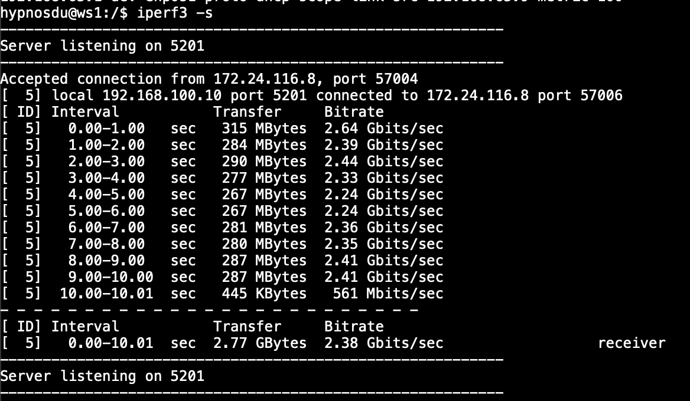

Вывод iperf3 -c 192.168.100.10 для ws2:


## Part 4. Сетевой экран

#### 4.1. Утилита **iptables**

ЗАДАЧА: cоздать файл */etc/firewall.sh*, имитирующий фаерволл, на ws1 и ws2:
```shell
#!/bin/sh

# Удаление всех правил в таблице «filter» (по-умолчанию).
iptables -F
iptables -X
```

Вывод cat /etc/firewall.sh для ws1:
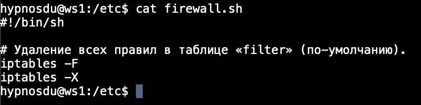

Вывод cat /etc/firewall.sh для ws2:
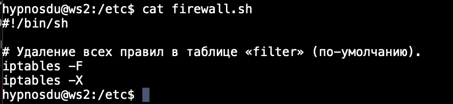

ЗАДАЧА: добавить в файл подряд следующие правила:
1) На ws1 примени стратегию, когда в начале пишется запрещающее правило, а в конце пишется разрешающее правило (это касается пунктов 4 и 5).
2) На ws2 примени стратегию, когда в начале пишется разрешающее правило, а в конце пишется запрещающее правило (это касается пунктов 4 и 5).
3) Открой на машинах доступ для порта 22 (ssh) и порта 80 (http).
4) Запрети *echo reply* (машина не должна «пинговаться», т.е. должна быть блокировка на OUTPUT).
5) Разреши *echo reply* (машина должна «пинговаться»).

ЗАДАЧА: поместить в отчет скрины с содержанием файла */etc/firewall* для каждой машины.

Вывод cat /etc/firewall.sh для ws1:
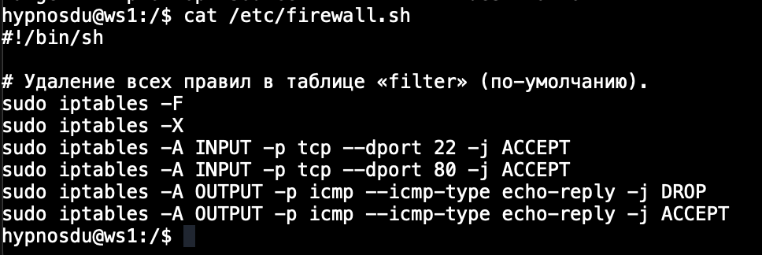

Вывод cat /etc/firewall.sh для ws2:
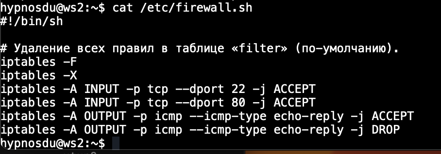

ЗАДАЧА: запустить файлы на обеих машинах командами `chmod +x /etc/firewall.sh` и `/etc/firewall.sh`. В отчёт помести скрины с запуском обоих файлов:

Вывод команд `chmod +x /etc/firewall.sh` и `/etc/firewall.sh` для ws1:


Вывод команд `chmod +x /etc/firewall.sh` и `/etc/firewall.sh` для ws2:


ЗАДАЧА: описать разницу между стратегиями, применёнными в первом и втором файлах

- Разница в том, что на ws1 стоит для echo-request стоит правило DROP и поскольку оно стоит выше, то следущее правило не применяется.

#### 4.2. Утилита **nmap**

ЗАДАЧА: командой **ping** найти машину, которая не «пингуется», после чего утилитой **nmap** показать, что хост машины запущен *Проверка: в выводе nmap должно быть сказано: `Host is up`*. В отчёт поместить скрины с вызовом и выводом использованных команд **ping** и **nmap**

Вывод ping ws1 с ws2 и nmap c ip ws1:
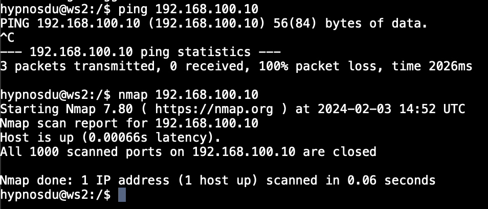

ЗАДАЧА: сохранить дампы образов виртуальных машин. **P.S. Ни в коем случае не сохранять дампы в гит!**

РЕШЕНИЕ: нет функции сохранения дампов образов виртуальных машин в UTM

## Part 5. Статическая маршрутизация сети

Создаваемая сеть: \


ЗАДАЧА: поднять пять виртуальных машин (3 рабочие станции (ws11, ws21, ws22) и 2 роутера (r1, r2)).

Скрин пяти виртуальных машин:
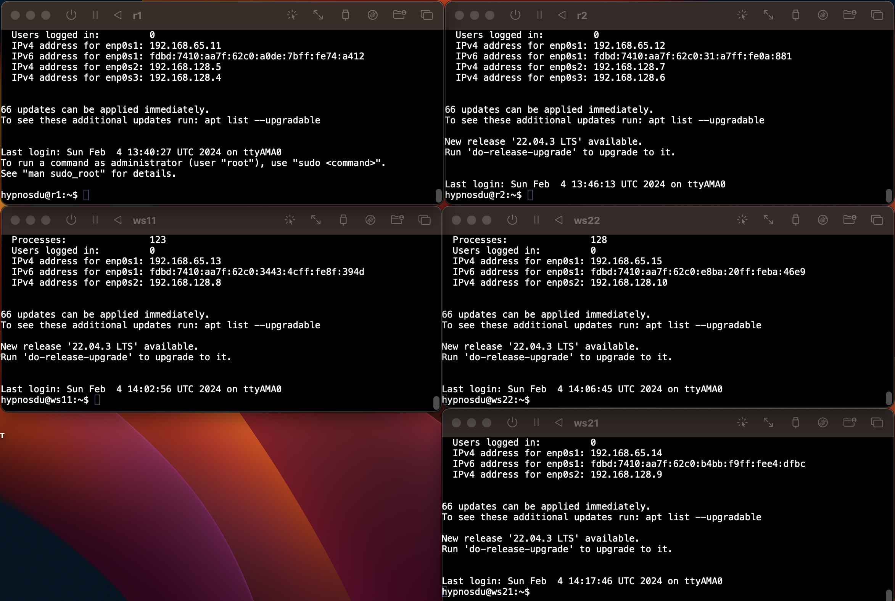

#### 5.1. Настройка адресов машин

ЗАДАЧА: настроить конфигурации машин в *etc/netplan/00-installer-config.yaml* согласно сети на рисунке. В отчёт помести скрины с содержанием файла *etc/netplan/00-installer-config.yaml* для каждой машины.

Вывод 00-installer-config.yaml для r1:
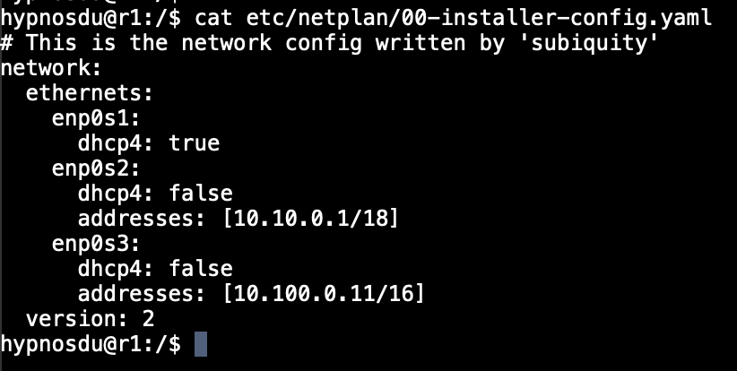

Вывод 00-installer-config.yaml для r2:
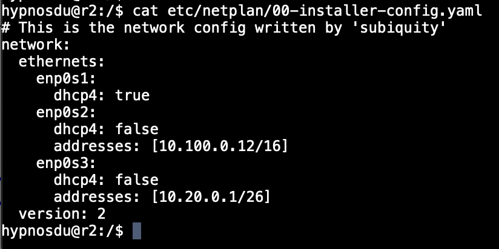

Вывод 00-installer-config.yaml для ws11:
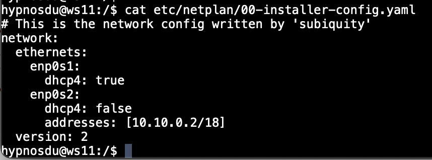

Вывод 00-installer-config.yaml для ws21:
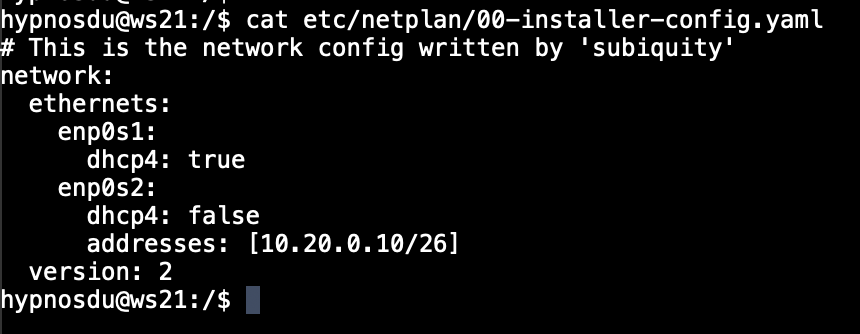

Вывод 00-installer-config.yaml для ws22:
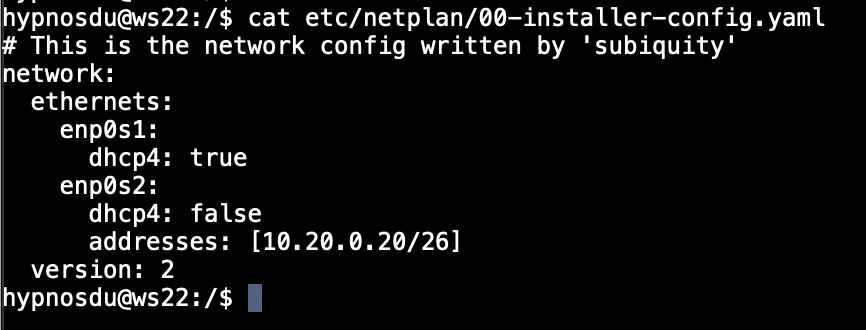

ЗАДАЧА: перезапустить сервис сети. Если ошибок нет, то командой `ip -4 a` проверить, что адрес машины задан верно. Также пропинговать ws22 с ws21. Аналогично пропинговать r1 с ws11. В отчёт поместить скрины с вызовом и выводом использованных команд.

Вывод `ip -4 a` для r1:
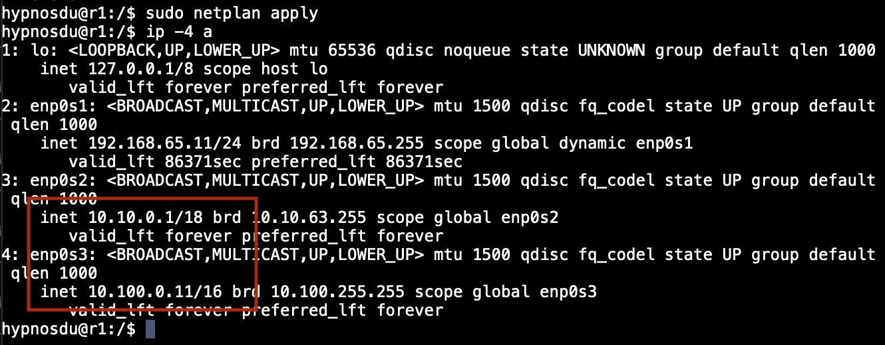

Вывод `ip -4 a` для r2:
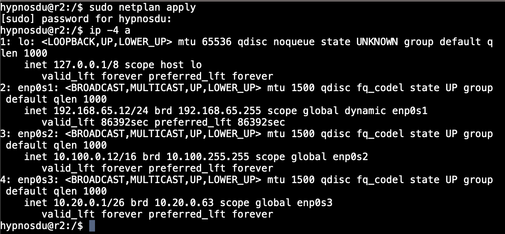

Вывод `ip -4 a` для ws11:
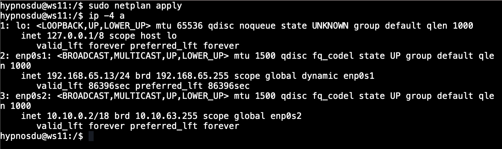

Вывод `ip -4 a` для ws21:
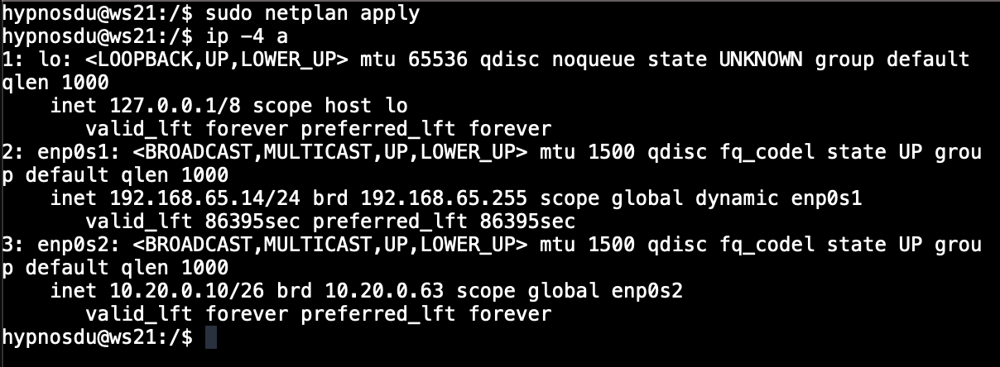

Вывод `ip -4 a` для ws22:
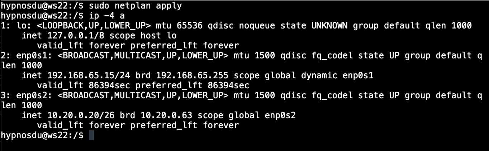

Вывод ping ws22 c ws21:
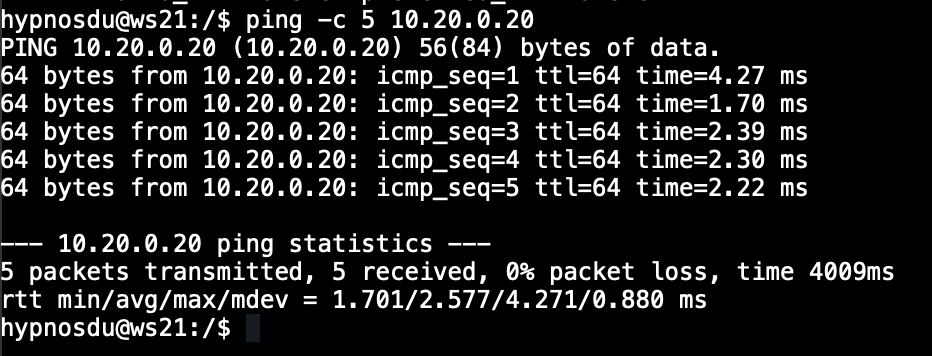

Вывод ping r1 c ws11:
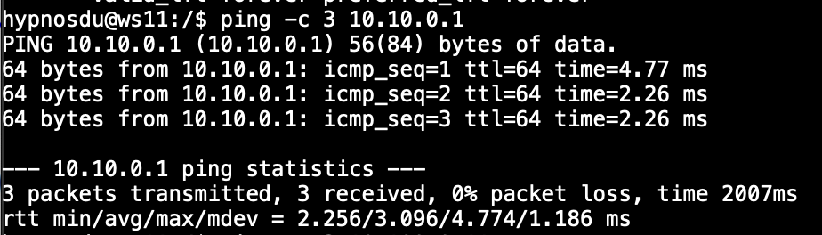

#### 5.2. Включение переадресации IP-адресов

ЗАДАЧА: для включения переадресации IP, выполнить команду на роутерах:
`sysctl -w net.ipv4.ip_forward=1`. При таком подходе переадресация не будет работать после перезагрузки системы. В отчёт поместить скрин с вызовом и выводом использованной команды.

Вывод `sysctl -w net.ipv4.ip_forward=1` для r1:


Вывод `sysctl -w net.ipv4.ip_forward=1` для r2:
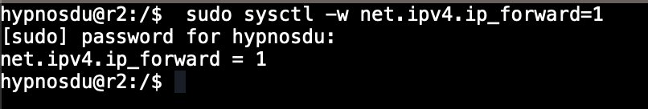

ЗАДАЧА: открыть файл */etc/sysctl.conf* и добавить в него следующую строку: `net.ipv4.ip_forward = 1`. При использовании этого подхода, IP-переадресация включена на постоянной основе. В отчёт поместить скрин с содержанием изменённого файла */etc/sysctl.conf*.

Вывод `cat /etc/sysctl.conf` для r1:
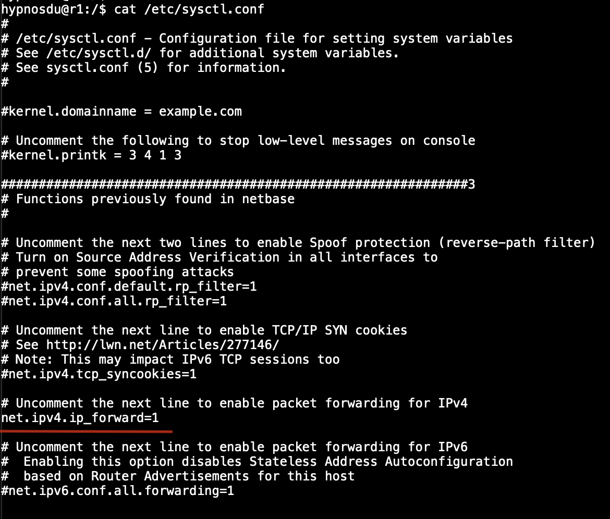

Вывод `cat /etc/sysctl.conf` для r2:
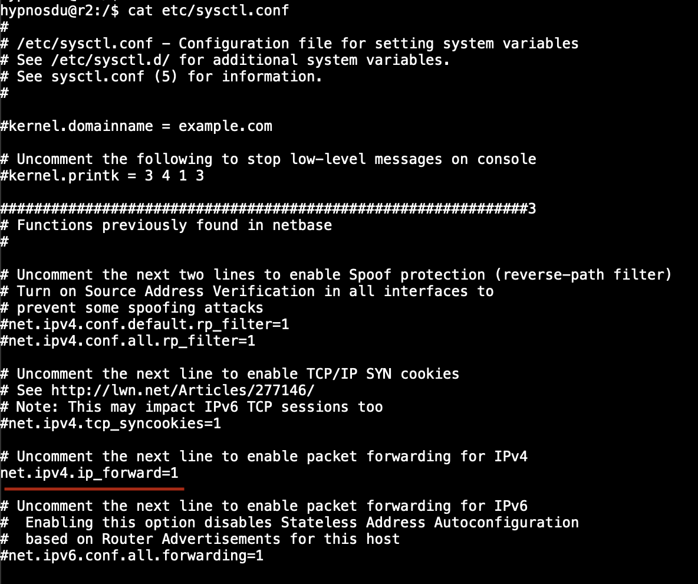

#### 5.3. Установка маршрута по-умолчанию

ЗАДАЧА: настроить маршрут по-умолчанию (шлюз) для рабочих станций. Для этого добавить `default` перед IP роутера в файле конфигураций. В отчёт поместить скрин с содержанием файла *etc/netplan/00-installer-config.yaml*;

Вывод `cat etc/netplan/00-installer-config.yaml` для ws11:
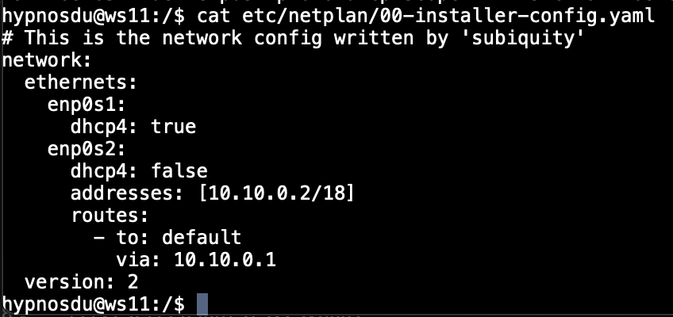

Вывод `cat etc/netplan/00-installer-config.yaml` для ws21:
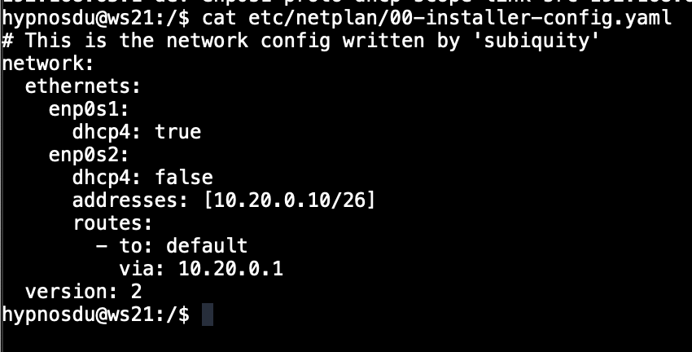

Вывод `cat etc/netplan/00-installer-config.yaml` для ws22:
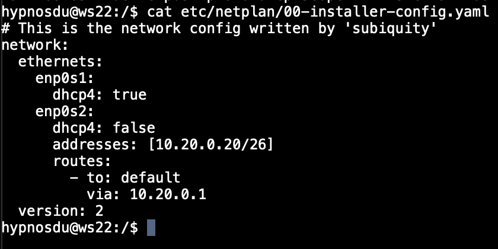

ЗАДАЧА: вызвать `ip r` и показать, что добавился маршрут в таблицу маршрутизации. В отчёт поместить скрин с вызовом и выводом использованной команды.

Вывод `ip r` для ws11:
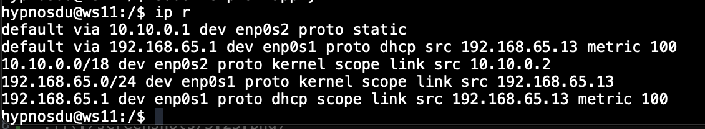

Вывод `ip r` для ws21:
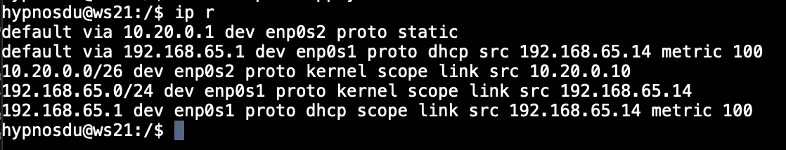

Вывод `ip r` для ws22:


Пример вывода команды `ip r` после добавления шлюза:
```
default via 10.10.0.1 dev eth0
10.10.0.0/18 dev eth0 proto kernel scope link src 10.10.0.2
```

ЗАДАЧА: пропинговать с ws11 роутер r2 и показать на r2, что пинг доходит. Для этого использовать команду: `tcpdump -tn -i eth0`. В отчёт поместить скрин с вызовом и выводом использованных команд.

Вывод `ping -c 5 10.100.0.12` для ws11:
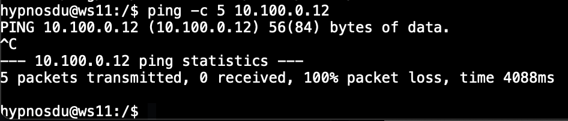

Вывод `tcpdump -tn -i enp0s2` для r2:
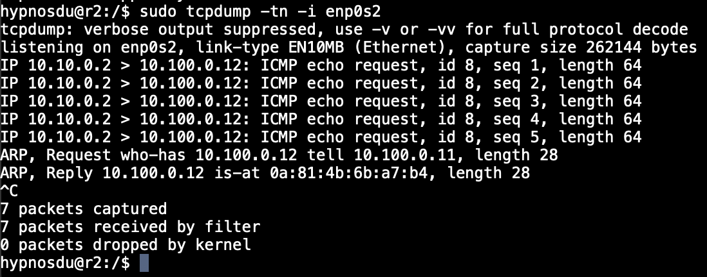

#### 5.4. Добавление статических маршрутов

ЗАДАЧА: добавить в роутеры r1 и r2 статические маршруты в файле конфигураций. В отчёт поместить скрины с содержанием изменённого файла *etc/netplan/00-installer-config.yaml* для каждого роутера.
Пример для r1 маршрута в сетку 10.20.0.0/26:
```shell
# Добавь в конец описания сетевого интерфейса eth1:
- to: 10.20.0.0
  via: 10.100.0.12
```

Вывод `cat etc/netplan/00-installer-config.yaml` для r1:
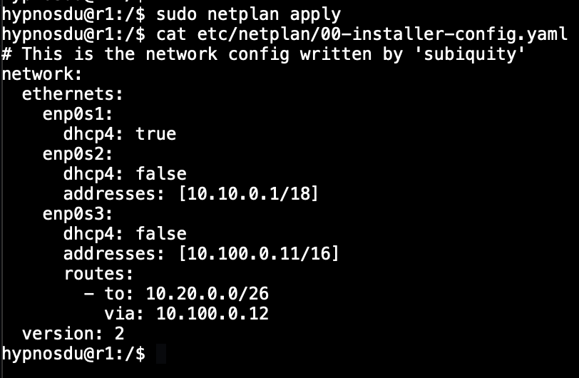

Вывод `cat etc/netplan/00-installer-config.yaml` для r2:
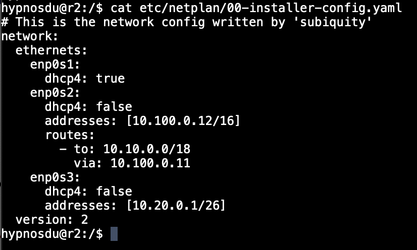

ЗАДАЧА: вызвать `ip r` и показать таблицы с маршрутами на обоих роутерах. В отчёт поместить скрин с вызовом и выводом использованной команды.

Вывод `ip r` для r1:
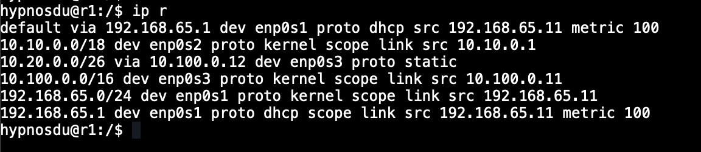

Вывод `ip r` для r2:
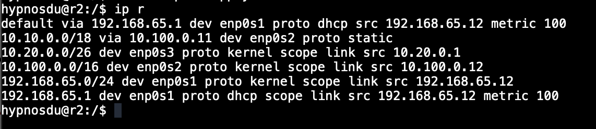

Пример таблицы на r1:
```
10.100.0.0/16 dev eth1 proto kernel scope link src 10.100.0.11
10.20.0.0/26 via 10.100.0.12 dev eth1
10.10.0.0/18 dev eth0 proto kernel scope link src 10.10.0.1
```

ЗАДАЧА: запустить команды на ws11: `ip r list 10.10.0.0/[маска сети]` и `ip r list 0.0.0.0/0`. В отчёт поместить скрин с вызовом и выводом использованных команд.

Вывод `ip r list 10.10.0.0/18` для ws11:
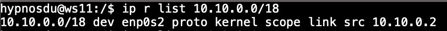

Вывод `ip r list 0.0.0.0/0` для ws11:
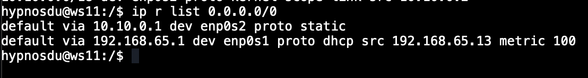

ЗАДАЧА: в отчёте объяснить, почему для адреса 10.10.0.0/\[маска сети\] был выбран маршрут, отличный от 0.0.0.0/0, хотя он попадает под маршрут по-умолчанию.

- Для адреса 10.10.0.0/18 был выбран маршрут, отличный от 0.0.0.0/0, поскольку ws11 соединена с сетью по своему ip адресу.

#### 5.5. Построение списка маршрутизаторов

Пример вывода утилиты **traceroute** после добавления шлюза:
```
1 10.10.0.1 0 ms 1 ms 0 ms
2 10.100.0.12 1 ms 0 ms 1 ms
3 10.20.0.10 12 ms 1 ms 3 ms
```
ЗАДАЧА: запустить на r1 команду дампа: `tcpdump -tnv -i eth0`. При помощи утилиты **traceroute** построить список маршрутизаторов на пути от ws11 до ws21. В отчёт поместить скрины с вызовом и выводом использованных команд (tcpdump и traceroute);

Вывод `traceroute 10.20.0.10` для ws11:
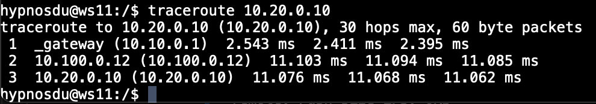

Вывод `tcpdump -tnv -i enp0s3` для r1:
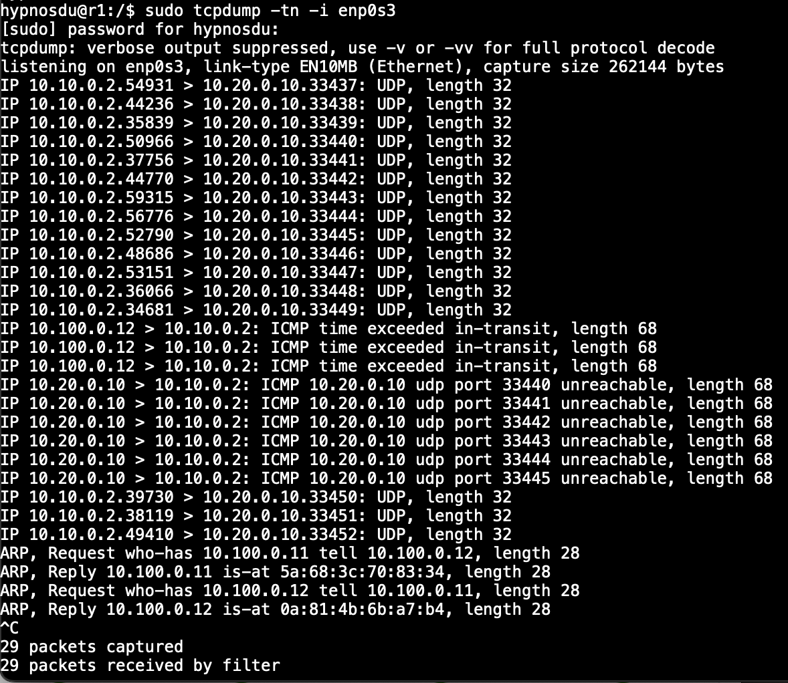

ЗАДАЧА: в отчёте, опираясь на вывод, полученный из дампа на r1, объяснить принцип работы построения пути при помощи **traceroute**.

- Утилита traceroute отслеживает путь, который IP пакет пройдет до определенного хоста, отправляя пакет с маленьким ttl (time to live), и ожидает от шлюза ответ ICMP "time exceeded". Получив ответ "time exceeded", утилита отправляет еще один пакет с увеличенным на 1 ttl до тех пор, пока не получит ответ ICMP "port unreachable", что означает, что хост был достигнут.

#### 5.6. Использование протокола **ICMP** при маршрутизации

ЗАДАЧА: запустить на r1 перехват сетевого трафика, проходящего через eth0 с помощью команды: `tcpdump -n -i eth0 icmp`

Вывод `tcpdump -tnv -i enp0s2 шсьз` для r1:


ЗАДАЧА: пропинговать с ws11 несуществующий IP (например, *10.30.0.111*) с помощью команды: `ping -c 1 10.30.0.111`. В отчёт поместить скрин с вызовом и выводом использованных команд.

Вывод `ping -c 1 10.30.0.111` для ws11:
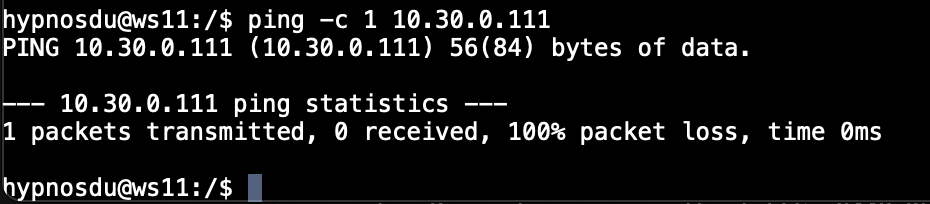

ЗАДАЧА: сохранить дампы образов виртуальных машин. **P.S. Ни в коем случае не сохраняй дампы в гит!**

- Сохранение дампов образов не поддерживается UTM

## Part 6. Динамическая настройка IP с помощью DHCP

Для r2 настроить в файле */etc/dhcp/dhcpd.conf* конфигурацию службы DHCP:, а именно: указать для r2 адрес маршрутизатора по-умолчанию, DNS-сервер и адрес внутренней сети.

- Устанавливаем dhcpd server командой `sudo apt install isc-dhcp-server`. После этого в директории etc/dhcp/ появится dhcpd.conf файл, которого у меня до этого не было.

Вывод `cat /etc/dhcp/dhcpd.conf` для r2:


Пример файла для r2:
```shell
subnet 10.100.0.0 netmask 255.255.0.0 {}

subnet 10.20.0.0 netmask 255.255.255.192
{
    range 10.20.0.2 10.20.0.50;
    option routers 10.20.0.1;
    option domain-name-servers 10.20.0.1;
}
```
ЗАДАЧА: в файле *resolv.conf* для r2 прописать `nameserver 8.8.8.8`. В отчёт поместить скрины с содержанием изменённых файлов.

Вывод `cat etc/resolv.conf` для r2:


ЗАДАЧА: перезагрузить службу DHCP командой `systemctl restart isc-dhcp-server`. Машину ws21 перезагрузить при помощи `reboot` и через `ip a` показать, что она получила адрес. Также пропингуй ws22 с ws21. В отчёт поместить скрины с вызовом и выводом использованных команд.

Вывод `systemctl restart isc-dhcp-server` для r2:
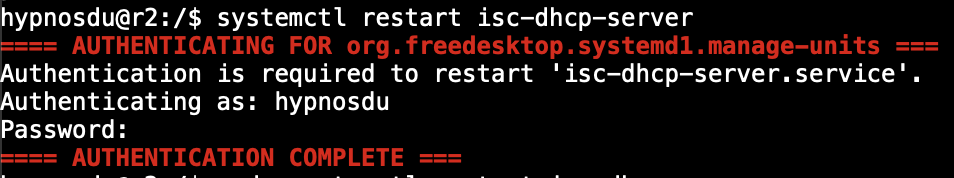

- Перезагрузку машины ws21 выполняем командой sudo reboot

Вывод `ip a` для ws21:


Вывод ping ws22 c ws21:
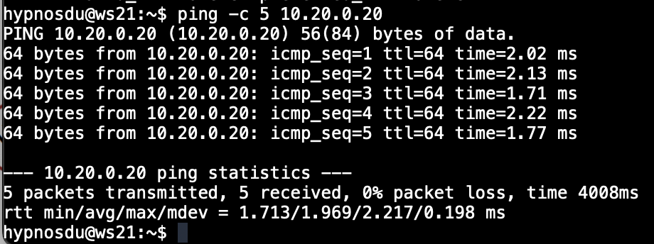


ЗАДАЧА: указать MAC адрес у ws11, для этого в *etc/netplan/00-installer-config.yaml* надо добавить строки: `macaddress: 10:10:10:10:10:BA`, `dhcp4: true`. В отчёт поместить скрин с содержанием изменённого файла *etc/netplan/00-installer-config.yaml*.

Вывод `cat etc/netplan/00-installer-config.yaml` для ws11:
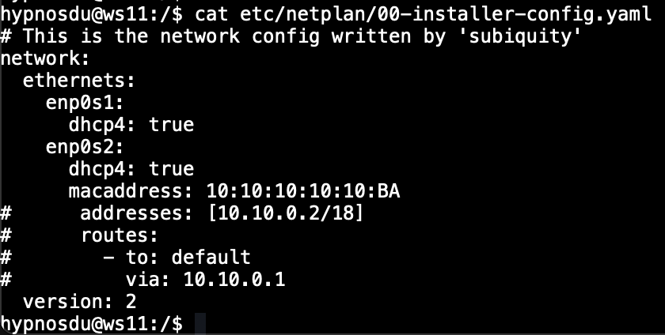

- Перезагружаем машины ws11 командой sudo reboot

Вывод `ip a` для ws11:
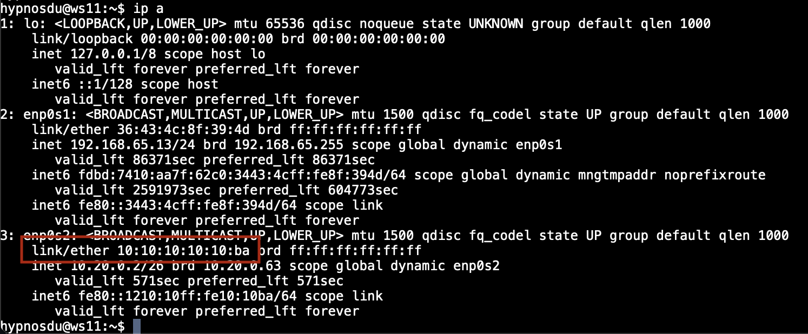

ЗАДАЧА: для r1 настроить аналогично r2, но сделать выдачу адресов с жесткой привязкой к MAC-адресу (ws11). Провести аналогичные тесты. В отчёте этот пункт описать аналогично настройке для r2.

- Устанавливаем на r1 dhcpd server командой `sudo apt install isc-dhcp-server`.

Вывод `cat /etc/dhcp/dhcpd.conf` для r1:
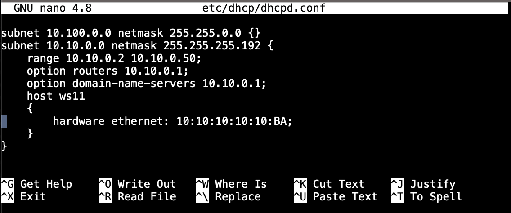

Вывод `cat etc/resolv.conf` для r1:
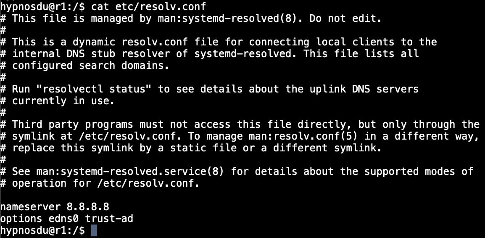

Вывод `systemctl restart isc-dhcp-server` для r1:
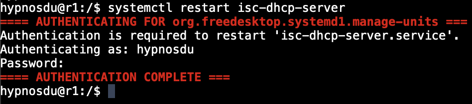

- Перезагрузку машины ws21 выполняем командой sudo reboot

Вывод `ip a` для ws21:
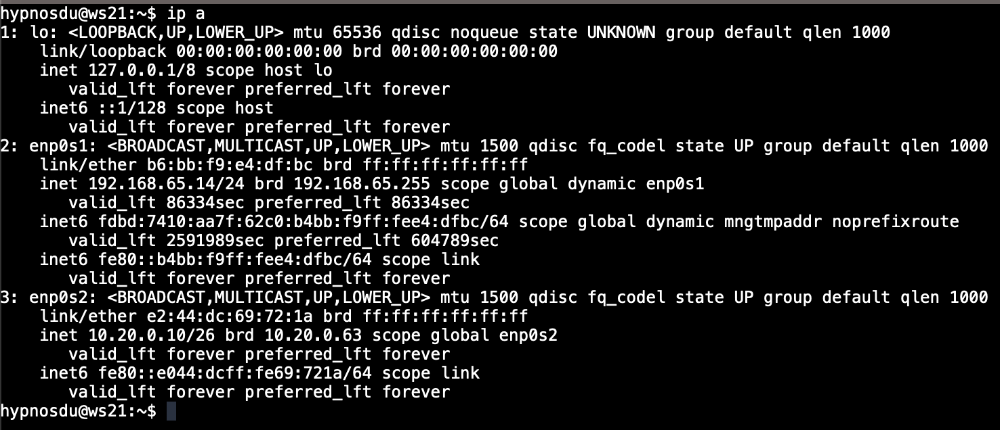

Вывод ping ws21 c ws11:
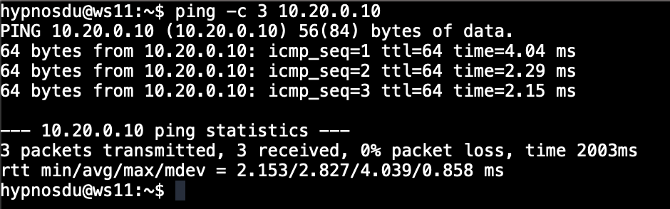

ЗАДАЧА: запросить с ws21 обновление ip адреса. В отчёте поместить скрины ip до и после обновления.

Вывод `ip a` для ws21 до обновления:
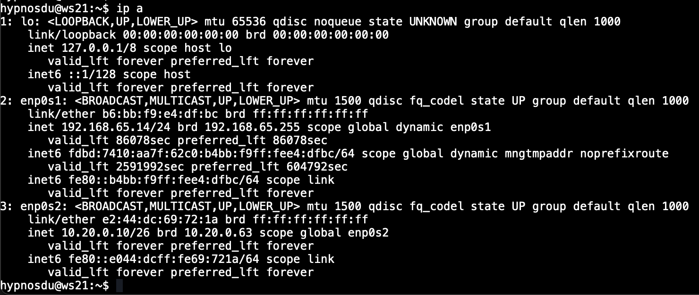

Вывод `sudo dhclient -v` для ws21:
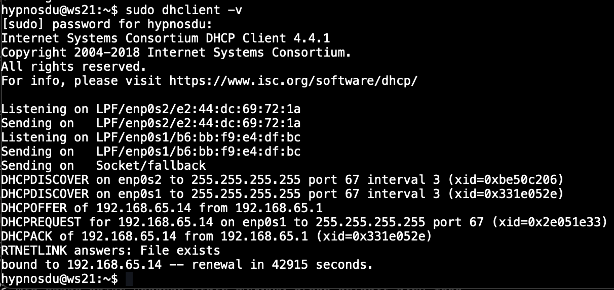

Вывод `ip a` для ws21 после обновления:
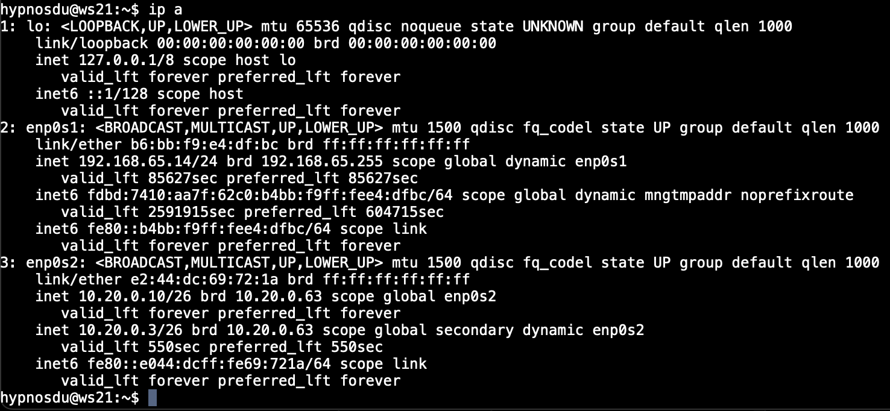

ЗАДАЧА: В отчёте опиши, какими опциями DHCP сервера пользовался в данном пункте.

Были использованы следующие опции DHCP сервера:
1) option routers - эта опция определяет перечень IP адресов для маршрутизаторов на подсети клиента.
2) option domain-name-servers - опция определяет по каким адресам на клиенте доступны сервера DNS.

ЗАДАЧА: сохранить дампы образов виртуальных машин. Ни в коем случае не сохраняй дампы в гит!

- в UTM отсутствует функция сохранения дампов образов.

## Part 7. NAT

ЗАДАЧА: в файле */etc/apache2/ports.conf* на ws22 и r1 изменить строку `Listen 80` на `Listen 0.0.0.0:80`, то есть сделать сервер Apache2 общедоступным. В отчёт поместить скрин с содержанием изменённого файла.

Вывод `cat /etc/apache2/ports.conf` для ws22:
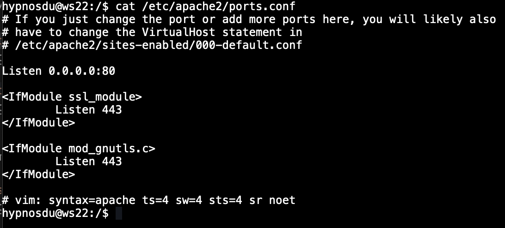

ЗАДАЧА: запустить веб-сервер Apache командой `service apache2 start` на ws22 и r1. В отчёт поместить скрины с вызовом и выводом использованной команды.

Вывод `service apache2 start` для ws22:


Вывод `service apache2 start` для r1:
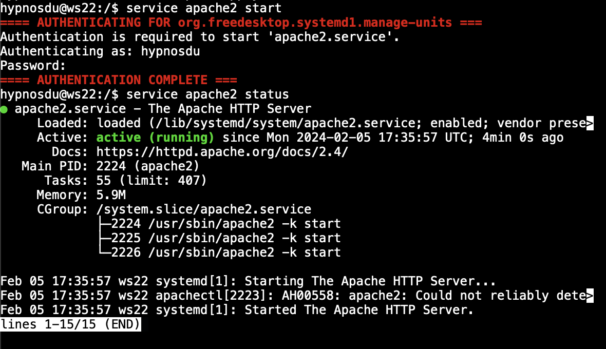

ЗАДАЧА: добавить в фаервол, созданный по аналогии с фаерволом из Части 4, на r2 следующие правила:
1) Удаление правил в таблице filter - `iptables -F`;
2) Удаление правил в таблице "NAT" - `iptables -F -t nat`;
3) Отбрасывать все маршрутизируемые пакеты - `iptables --policy FORWARD DROP`.

ЗАДАЧА: запустить файл также, как в Части 4.


ЗАДАЧА: проверить соединение между ws22 и r1 командой `ping`. При запуске файла с этими правилами, ws22 не должна «пинговаться» с r1. В отчёт поместить скрины с вызовом и выводом использованной команды.


ЗАДАЧА: добавить в файл ещё одно правило - разрешить маршрутизацию всех пакетов протокола ICMP.

ЗАДАЧА: запустить файл также, как в Части 4.

ЗАДАЧА: проверить соединение между ws22 и r1 командой `ping`. При запуске файла с этими правилами, ws22 должна «пинговаться» с r1. В отчёт поместить скрины с вызовом и выводом использованной команды.

ЗАДАЧА: добавить в файл ещё два правила:
5) Включить SNAT, а именно маскирование всех локальных ip из локальной сети, находящейся за r2 (по обозначениям из Части 5 - сеть 10.20.0.0).
*Совет: стоит подумать о маршрутизации внутренних пакетов, а также внешних пакетов с установленным соединением.*
6) Включить DNAT на 8080 порт машины r2 и добавить к веб-серверу Apache, запущенному на ws22, доступ извне сети.
*Совет: стоит учесть, что при попытке подключения возникнет новое tcp-соединение, предназначенное ws22 и 80 порту.*
- В отчёт помести скрин с содержанием изменённого файла.

ЗАДАЧА: запустить файл также, как в Части 4.


*Перед тестированием рекомендуется отключить сетевой интерфейс NAT (его наличие можно проверить командой `ip a`) в VirtualBox, если он включен.*

ЗАДАЧА: проверить соединение по TCP для SNAT: для этого с ws22 подключиться к серверу Apache на r1 командой `telnet [адрес] [порт]`


ЗАДАЧА: проверить соединение по TCP для DNAT: для этого с r1 подключиться к серверу Apache на ws22 командой `telnet` (обращаться по адресу r2 и порту 8080). В отчёт помести скрины с вызовом и выводом использованных команд.

ЗАДАЧА: сохранить дампы образов виртуальных машин. P.S. Ни в коем случае не сохраняй дампы в гит!

- В UTM отсутствует функционал по сохранению дампов образов виртуальных машин.

## Part 8. Дополнительно. Знакомство с SSH Tunnels

